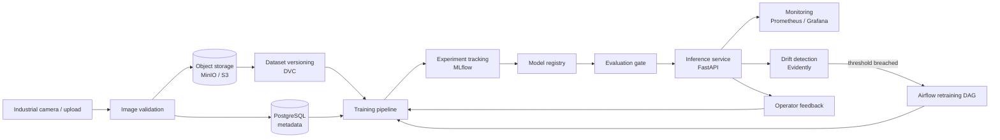

# FactoryAI

**Industrial Visual Inspection Platform with End-to-End MLOps**

FactoryAI is a production-oriented platform for automated visual quality inspection on a
manufacturing line. Products are photographed as they leave the line; FactoryAI validates
and versions the images, trains unsupervised anomaly-detection models, promotes them
through a registry, serves them behind a hardened API, and watches them in production —
retraining automatically when the data drifts away from what the model was trained on.

> The anomaly detection model is one component of roughly twenty. This repository is about
> the platform *around* the model: data contracts, lineage, reproducibility, deployment,
> observability, and the feedback loop that keeps the system honest over time.

---

## Status

| | |
|---|---|
| **Phase** | 3 complete — ingestion & validation pipeline, `factoryai ingest`. Next: Phase 4, dataset versioning with DVC |
| **Model** | PatchCore (Anomalib), plugin architecture for PaDiM / FastFlow / RD / AE |
| **Dataset** | MVTec AD — `bottle` first, category is configuration, not code |
| **Runtime** | Python 3.11, Docker Compose locally, Kubernetes manifests for cluster |

See [docs/ROADMAP.md](docs/ROADMAP.md) for the full phase plan and what "done" means at each step.

---

## What the system does



Full narrative in [docs/ARCHITECTURE.md](docs/ARCHITECTURE.md).

---

## Quick start

**Working today** (Phases 0–3 — toolchain, domain model, persistence, ingestion):

```bash
git clone <repo> && cd factoryAI
cp .env.example .env

make venv && make install     # Windows: .\make.ps1 venv ; .\make.ps1 install
make quality                  # lint, format, mypy strict, layer contracts, unit tests

make up                       # postgres + minio + adminer, buckets auto-provisioned
make migrate                  # apply the schema
make test-integration         # repositories, storage and ingestion against real containers

factoryai ingest --path ./some/images --category bottle --report-path report.json
```

**Planned** — the contract later phases are built against:

```bash
make seed         # download the real MVTec bottle set and ingest it (Phase 4)
make train        # run the PatchCore training pipeline               (Phase 5)
```

| Service | URL | Purpose |
|---|---|---|
| Dashboard | http://localhost:3000 | Operator + engineer UI |
| API | http://localhost:8000 | Inference, ingestion, admin |
| MLflow | http://localhost:5000 | Experiments & model registry |
| MinIO console | http://localhost:9001 | Object storage |
| Airflow | http://localhost:8080 | Orchestration |
| Grafana | http://localhost:3001 | Dashboards |
| Prometheus | http://localhost:9090 | Metrics |

---

## Repository layout

```
factoryAI/
├── services/
│   ├── api/            FastAPI — presentation layer (HTTP, auth, DI wiring)
│   ├── worker/         Celery workers — retraining, bulk inference, reports
│   └── frontend/       React dashboard
├── src/factoryai/
│   ├── domain/         Entities, value objects, ports. Zero external deps.
│   ├── application/    Use cases orchestrating domain + ports
│   ├── infrastructure/ Adapters: postgres, minio, mlflow, anomalib, evidently
│   └── shared/         Config, logging, errors, types
├── pipelines/
│   ├── training/       Composable training pipeline steps
│   └── airflow/        DAGs: validate, version, train, evaluate, deploy, monitor
├── database/           SQL migrations (Alembic), seed data
├── deploy/
│   ├── docker/         Dockerfiles per service
│   ├── compose/        docker-compose stacks
│   ├── kubernetes/     Manifests + Helm chart
│   └── terraform/      Cloud infrastructure modules
├── monitoring/         Prometheus rules, Grafana dashboards, Evidently configs
├── tests/              unit / integration / e2e
├── scripts/            Operational scripts (seed, backfill, smoke tests)
└── docs/               Architecture, ADRs, runbooks, API reference
```

Rationale for this shape is in [docs/ARCHITECTURE.md](docs/ARCHITECTURE.md#repository-layout).

---

## Documentation

| Document | Contents |
|---|---|
| [ROADMAP.md](docs/ROADMAP.md) | The 14 incremental phases, each with scope, deliverables and exit criteria |
| [ARCHITECTURE.md](docs/ARCHITECTURE.md) | Clean-architecture layering, ports & adapters, request flows, scalability |
| [DATA_MODEL.md](docs/DATA_MODEL.md) | ER diagram, table definitions, indexing and retention strategy |
| [ADRs](docs/adr/) | Architecture decision records — what was chosen, what was rejected, why |
| [CONTRIBUTING.md](docs/CONTRIBUTING.md) | Dev environment, code standards, test strategy, commit conventions |

---

## Design principles

1. **The ML code never touches HTTP or SQL.** Domain and application layers depend on
   abstract ports; Anomalib, SQLAlchemy, MinIO and MLflow live behind adapters.
2. **Everything is reproducible.** Every model artifact traces back to a dataset version,
   a Git commit, a config hash and a hardware fingerprint.
3. **Configuration over code.** Switching MVTec category, backbone, model family, or
   object-storage backend is a config change, not a code change.
4. **Fail closed.** A model is only promoted to production if it beats the incumbent on a
   held-out set. Deployment gates are automated, not manual.
5. **Auditability is a feature.** Deployments, rollbacks, dataset changes and predictions
   are immutable records, not log lines.

---

## License

TBD.
