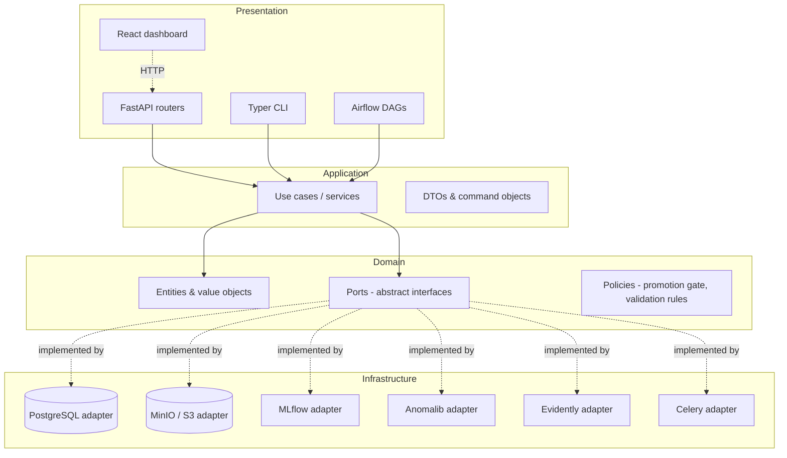
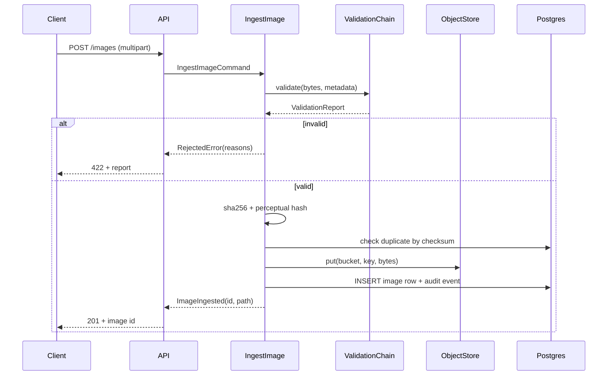
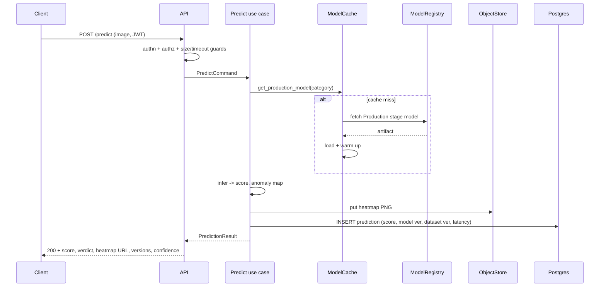
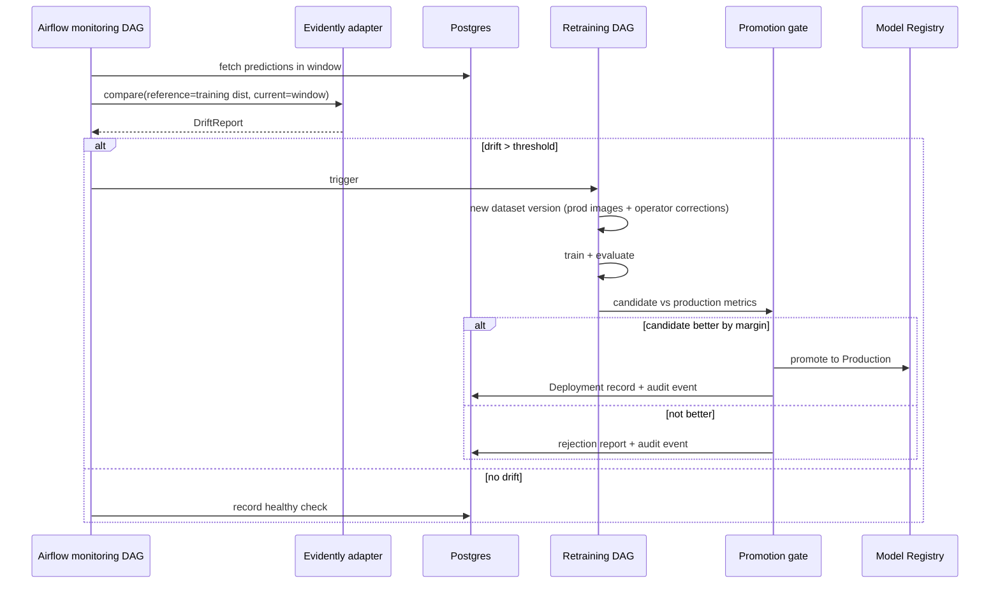

# FactoryAI — Architecture

## 1. Architectural style

FactoryAI uses **Clean Architecture (Ports & Adapters)**. The rule that governs every
import in the repository:

> Dependencies point inwards. The domain knows nothing about FastAPI, SQLAlchemy, MinIO,
> MLflow, Airflow or Anomalib.



### Why this matters here specifically

Industrial platforms outlive their infrastructure choices. MinIO becomes S3 when the plant
moves to AWS. MLflow may become SageMaker Model Registry. PatchCore becomes whatever wins
the next benchmark. Each of those is an adapter swap in this design, and each is a rewrite
in a notebook-shaped project.

### Enforcement

Layering is not a convention here, it is a CI check. `import-linter` contracts fail the
build if `domain/` imports `infrastructure/`, or if `application/` imports a web framework.

---

## 2. Layers in detail

### 2.1 Domain (`src/factoryai/domain/`)

Pure Python. Stdlib + Pydantic only.

**Entities** carry identity and invariants:
`InspectionImage`, `Dataset`, `DatasetVersion`, `Experiment`, `ModelVersion`,
`Deployment`, `Prediction`, `Feedback`, `AuditEvent`, `User`.

**Value objects** are immutable and self-validating: `Checksum` (sha256 hex, 64 chars),
`Resolution` (positive ints), `AnomalyScore` (float with a threshold-relative verdict),
`Category` (one of the 15 MVTec classes), `ModelStage`, `ProcessingStatus`.

**Ports** are ABCs the outside world must satisfy:

| Port | Responsibility |
|---|---|
| `ImageRepository` | Persist and query inspection image metadata |
| `DatasetRepository` | Dataset and dataset-version records |
| `ObjectStore` | `put`, `get`, `delete`, `presign` on binary blobs |
| `ExperimentTracker` | Start run, log params/metrics/artifacts, close run |
| `ModelRegistry` | Register, stage, fetch, list model versions |
| `AnomalyDetector` | `fit(dataset) -> TrainedModel`, `predict(image) -> Prediction` |
| `DriftDetector` | `compare(reference, current) -> DriftReport` |
| `TaskQueue` | Enqueue background work, query status |
| `UnitOfWork` | Transactional boundary across repositories |
| `Clock` / `IdGenerator` | Determinism in tests |

**Policies** encode business rules that are not CRUD: the promotion gate, the validation
rule chain, the drift threshold policy, the retention policy.

### 2.2 Application (`src/factoryai/application/`)

One class per use case, one public method (`execute`). Use cases receive ports through the
constructor — no service locator, no global state.

```
IngestImage              CreateDatasetVersion       TrainModel
ValidateBatch            PromoteModel               EvaluateModel
Predict                  RollbackDeployment         RunDriftAnalysis
BatchPredict             SubmitFeedback             TriggerRetraining
```

Use cases are the only place transactions are opened, audit events emitted, and domain
errors translated into application results.

### 2.3 Infrastructure (`src/factoryai/infrastructure/`)

Adapters, grouped by technology: `persistence/` (SQLAlchemy models, repositories,
Alembic), `storage/` (MinIO, S3, Azure, GCS, local), `tracking/` (MLflow),
`models/` (Anomalib plugin registry), `monitoring/` (Evidently, Prometheus),
`messaging/` (Celery).

The SQLAlchemy models are **not** the domain entities. Mappers translate between them.
This costs a little code and buys the freedom to change either side independently.

### 2.4 Presentation (`services/`)

FastAPI routers, the Typer CLI, Airflow DAGs and the React app are all thin. A router
resolves dependencies, builds a command object, calls a use case, maps the result to a
response model. Any router longer than ~30 lines is a design smell.

---

## 3. Dependency injection

A composition root (`src/factoryai/bootstrap/container.py`) reads settings and wires
concrete adapters to ports once, at startup. FastAPI's `Depends` pulls from the container;
Celery workers and Airflow tasks build the same container from the same settings.

Consequences: tests inject fakes without patching, and `STORAGE_BACKEND=s3` changes one
line in the container rather than N call sites.

---

## 4. Key flows

### 4.1 Ingestion



Failure between `put` and `INSERT` triggers a compensating delete; an orphan-sweeper job
reconciles anything that still slips through.

### 4.2 Inference



### 4.3 Drift → retraining



---

## 5. Model plugin architecture

`AnomalyDetector` is the port. Each model family is a registered adapter:

```python
@register_detector("patchcore")
class PatchCoreDetector(AnomalyDetector):
    def __init__(self, config: PatchCoreConfig) -> None: ...
    def fit(self, dataset: DatasetVersion) -> TrainedModel: ...
    def predict(self, image: ImageTensor) -> RawPrediction: ...
```

`configs/bottle/patchcore.yaml` selects the family and its hyperparameters. Adding
FastFlow means adding one adapter file and one config file — no changes to the training
pipeline, the API, or the registry.

Category is equally configuration: `configs/categories/*.yaml` holds resolution,
normalisation, augmentation and threshold policy per MVTec class. Only `bottle` is enabled
in Phase 5; the other 14 are present and disabled.

---

## 6. Cross-cutting concerns

**Configuration.** Pydantic `BaseSettings`, layered: code defaults → `configs/*.yaml` →
environment variables → CLI flags. Secrets only ever arrive via environment or a secret
manager. Every config object hashes itself; the hash is logged with each training run.

**Logging.** `structlog` JSON output. A correlation ID is created at the API edge, carried
into Celery headers and Airflow task context, and attached to every log line and audit row.

**Errors.** Domain exceptions (`ValidationFailed`, `DuplicateImage`, `PromotionRejected`)
are mapped to HTTP status codes in exactly one place — an exception handler module.

**Time and randomness.** Injected via `Clock` and a seeded RNG so training and tests are
reproducible.

---

## 7. Scalability

| Dimension | Approach |
|---|---|
| Inference throughput | Stateless API, horizontally scaled behind an Ingress; model cached per pod; HPA on p95 latency and queue depth |
| Large batches | Celery `inference` queue with dedicated workers; results streamed to object storage, not held in memory |
| Training | Single-node GPU/CPU job today; the pipeline is a DAG of steps, so a distributed backend is an adapter swap |
| Metadata volume | Predictions table partitioned by month; hot window in Postgres, cold data archived to object storage as Parquet |
| Images | Object storage scales independently; Postgres stores paths and checksums only |
| Multi-category | Category is a partition key throughout — models, datasets, thresholds and dashboards are all per-category |

Bottleneck honesty: the first constraint at scale will be feature extraction on CPU during
PatchCore inference, not the API layer. The capacity model in Phase 14 measures it rather
than guessing.

---

## 8. Security

- JWT access/refresh, argon2 password hashing, deny-by-default route guards.
- Four roles with an explicit permission matrix (Phase 8).
- Least-privilege database roles: the API cannot run DDL; migrations use a separate role.
- Presigned, short-lived URLs for image and heatmap access — no public buckets.
- Immutable, hash-chained audit log.
- Container images scanned (Trivy) with HIGH/CRITICAL blocking the pipeline; SBOM published.
- Uploaded files are treated as hostile: size caps, content-type sniffing, decode in a
  bounded subprocess, no filename trust.

---

## 9. Repository layout

The split between `src/factoryai/` (the library: domain, application, infrastructure) and
`services/` (deployable processes) is deliberate. Services are thin shells that import the
library; this is what allows the API, the CLI, the Celery worker and the Airflow DAGs to
share exactly the same use cases with no duplication.

`pipelines/` holds orchestration definitions rather than logic. `deploy/` groups every
deployment target so infrastructure changes never touch application directories.

---

## 10. Trade-offs accepted

| Decision | Cost | Why it is worth it |
|---|---|---|
| Clean Architecture over a flat FastAPI app | More files, mapper boilerplate | Testability and swappable infrastructure; the whole point of the project |
| Separate ORM models and domain entities | Mapping code | The database schema can evolve without the domain following it |
| Anomalib instead of a hand-rolled PatchCore | Less control over internals | The platform is the deliverable; reimplementing research code is not |
| MLflow for both tracking and registry | Single point of failure | One less system to operate; the port allows replacing it later |
| Monorepo | Larger checkout, coupled CI | Atomic cross-cutting changes; correct choice at this size |
| Synchronous single-image `/predict` | Latency exposed to caller | Matches the line-side use case; batches go through the queue |

## 11. Future improvements

Active learning over the feedback queue; ONNX/TensorRT export for edge deployment;
multi-tenant plants; canary and shadow deployments; a feature store for embeddings;
label-studio integration for segmentation masks; cost tracking per inference.
