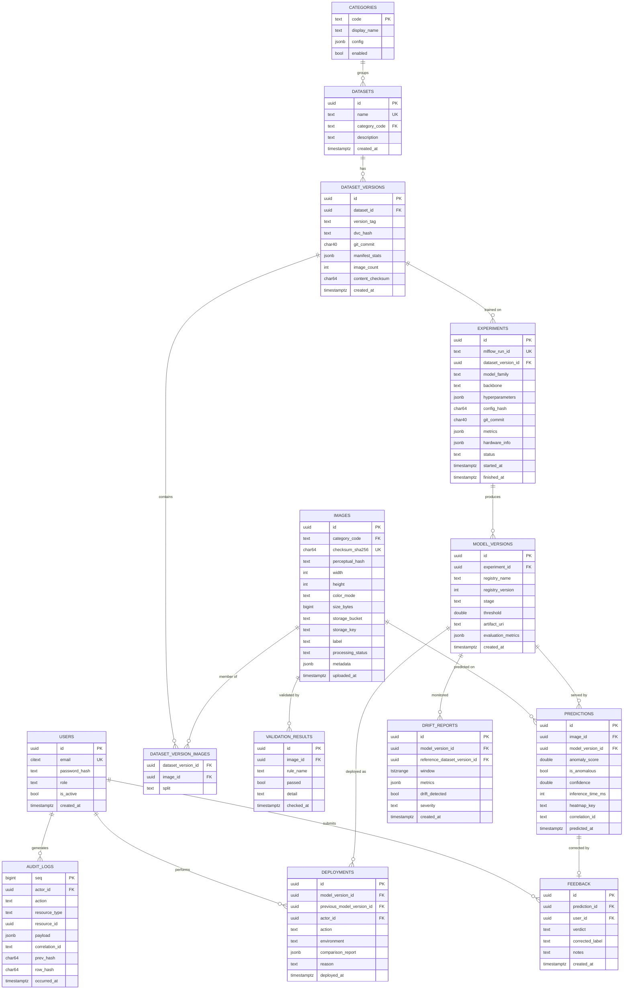

# FactoryAI — Data Model

PostgreSQL is the system of record for **metadata, lineage and audit**. Binary data
(images, heatmaps, model artifacts) lives in object storage; the database stores paths and
checksums only.

---

## 1. Entity-relationship diagram

---

## 2. Design notes

### Normalisation
Third normal form throughout, with two deliberate exceptions:
- `jsonb` columns for genuinely schemaless payloads (hyperparameters, metrics, audit
  payloads, category config). These are read-mostly and queried with GIN indexes.
- `EXPERIMENTS.metrics` duplicates what MLflow already holds. This is intentional: the
  dashboard must not depend on MLflow being reachable, and lineage queries stay in SQL.

### Identity
UUIDv7 primary keys everywhere except `AUDIT_LOGS`, which uses a monotonic `bigint`
sequence because ordering is part of its correctness guarantee.

### Immutability
`PREDICTIONS`, `DEPLOYMENTS`, `VALIDATION_RESULTS`, `DRIFT_REPORTS` and `AUDIT_LOGS` are
append-only. `UPDATE` and `DELETE` are revoked for the application role at the database
level, not merely avoided in code.

### Audit hash chain
Each audit row stores `row_hash = sha256(seq || actor || action || resource || payload ||
occurred_at || prev_hash)`. A verification script walks the chain; any tampered, inserted
or deleted row breaks it. Trigger-enforced so the application cannot forge a link.

### The many-to-many join
`DATASET_VERSION_IMAGES` is what makes versioning cheap: images are stored once, and a
dataset version is a *set* of image references plus a split assignment. Creating version
N+1 after adding 50 images copies 50 rows of references, not 50 images.

### Soft deletes
Not used. Images are never deleted; they are moved to `processing_status = 'quarantined'`
or `'archived'`. Retention is a lifecycle policy in object storage, mirrored by an
`archived_at` timestamp.

---

## 3. Enumerations

| Column | Values |
|---|---|
| `USERS.role` | `administrator`, `ml_engineer`, `operator`, `viewer` |
| `IMAGES.processing_status` | `pending`, `validating`, `valid`, `rejected`, `quarantined`, `archived` |
| `IMAGES.label` | `good`, `defect`, `unlabeled` (defect subtype lives in `metadata`) |
| `MODEL_VERSIONS.stage` | `development`, `staging`, `production`, `archived` |
| `DEPLOYMENTS.action` | `promote`, `rollback`, `archive`, `reject` |
| `EXPERIMENTS.status` | `running`, `completed`, `failed`, `aborted` |
| `FEEDBACK.verdict` | `correct`, `incorrect` |
| `DATASET_VERSION_IMAGES.split` | `train`, `val`, `test` |
| `DRIFT_REPORTS.severity` | `none`, `low`, `medium`, `high` |

Implemented as PostgreSQL native enums where the value set is stable, as check-constrained
text where it is likely to grow.

---

## 4. Indexing strategy

| Table | Index | Serves |
|---|---|---|
| `IMAGES` | unique `(checksum_sha256)` | duplicate detection on ingest |
| `IMAGES` | `(perceptual_hash)` | near-duplicate detection |
| `IMAGES` | `(category_code, processing_status, uploaded_at DESC)` | ingestion dashboards |
| `PREDICTIONS` | `(model_version_id, predicted_at DESC)` | drift windows, model quality panels |
| `PREDICTIONS` | `(predicted_at DESC)` on each partition | history view |
| `PREDICTIONS` | partial `(is_anomalous) WHERE is_anomalous` | defect trend queries |
| `DATASET_VERSION_IMAGES` | composite PK `(dataset_version_id, image_id)` | version materialisation |
| `EXPERIMENTS` | GIN on `metrics` | metric-threshold search |
| `AUDIT_LOGS` | `(resource_type, resource_id, occurred_at DESC)` | per-resource audit trail |
| `DEPLOYMENTS` | `(environment, deployed_at DESC)` | rollback target lookup |

`PREDICTIONS` is range-partitioned by month from day one — retrofitting partitioning onto
a hot table in production is painful, and this table is the one that grows without bound.

---

## 5. Retention

| Data | Hot (Postgres) | Cold | Deleted |
|---|---|---|---|
| Predictions | 90 days | Parquet in object storage, indefinite | never |
| Images | metadata forever | binaries tiered after 180 days | never |
| Heatmaps | 30 days | — | after 30 days, regenerable |
| Drift reports | 1 year | archived | never |
| Audit logs | forever | — | never |

---

## 6. Migrations

Alembic, one migration per PR, forward-only in production. Every migration is reviewed for
lock behaviour: no `ALTER TABLE` that rewrites a large table without a documented plan,
indexes created `CONCURRENTLY`, new columns nullable-then-backfilled-then-constrained.
