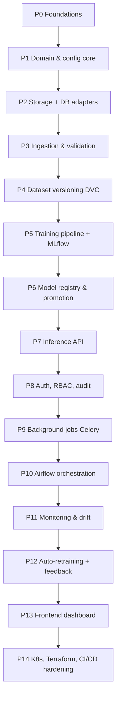

# FactoryAI — Incremental Build Roadmap

This document breaks the platform into **14 phases**. Each phase is independently
demonstrable, ends in a working system (never a half-wired one), and has explicit exit
criteria. Nothing is built "to be finished later" — every phase ships with tests, docs and
a runnable path.

**Rule for every phase:** type hints, docstrings, structured logging, Pydantic settings,
tests, and a docs update land *with* the feature, not after it.

---

## Phase map

Phases 0–7 build the vertical slice: *image in → prediction out, fully traceable*.
Phases 8–14 make it operable, observable and deployable.

---

## Phase 0 — Foundations & documentation *(complete)*

**Goal:** a repository that already looks like an enterprise project before a line of ML
is written.

**Scope**
- Repository skeleton, `README`, `ARCHITECTURE`, `DATA_MODEL`, `ROADMAP`, ADR directory.
- Tooling: `pyproject.toml` (uv/poetry), Ruff, Black, Mypy strict, pre-commit, pytest.
- `.env.example`, `Makefile` task interface, `.gitignore`, `.dockerignore`.
- Git repository initialised with Conventional Commits.
- CI skeleton: lint + typecheck + unit tests on PR.

**Exit criteria**
- `make lint`, `make typecheck`, `make test` all pass on an empty-but-structured repo.
- ADR-0001..0005 recorded (architecture style, model library, storage, orchestration, DB).
- A reader can understand the whole system from `docs/` without reading code.

---

## Phase 1 — Domain model & configuration core *(complete)*

**Goal:** the vocabulary of the system, dependency-free.

**Scope**
- `domain/entities`: `InspectionImage`, `Dataset`, `DatasetVersion`, `Experiment`,
  `ModelVersion`, `Prediction`, `Feedback`, `Deployment`, `AuditEvent`.
- `domain/value_objects`: `Checksum`, `Resolution`, `AnomalyScore`, `Category`,
  `ModelStage`, `ProcessingStatus`.
- `domain/ports`: `ImageRepository`, `ObjectStore`, `ExperimentTracker`, `ModelRegistry`,
  `AnomalyDetector`, `DriftDetector`, `Clock`, `UnitOfWork`.
- `shared/config`: layered Pydantic `Settings` (defaults → YAML → env → CLI).
- `shared/logging`: structured JSON logging with correlation IDs.
- `shared/errors`: domain exception hierarchy mapped later to HTTP codes.

**Exit criteria**
- `domain/` imports nothing outside stdlib + Pydantic. Enforced by an import-linter rule in CI.
- 100% unit test coverage on domain invariants (e.g. a `Checksum` cannot be malformed).
- Category config for all 15 MVTec classes exists; only `bottle` is enabled.

**Delivered.** The domain ended up stricter than planned: it depends on the standard
library alone (no Pydantic — frozen dataclasses validate in `__post_init__`), which is
now its own import-linter contract. 238 unit tests, 88% coverage, all five layer
contracts held. Notable adapter-facing decision made while wiring `shared/config.py`:
`STORAGE_BACKEND=minio` defaults to MinIO's well-known local credentials so a fresh
checkout runs with zero configuration, while `s3`/`azure`/`gcs` still fail closed without
an explicit key — see the validators on `StorageSettings`.

---

## Phase 2 — Infrastructure adapters: object storage + database *(complete)*

**Goal:** real persistence behind the Phase 1 ports.

**Scope**
- PostgreSQL schema + Alembic migrations for the tables in [DATA_MODEL.md](DATA_MODEL.md).
- SQLAlchemy 2.0 repositories implementing the domain ports; Unit-of-Work transaction boundary.
- `ObjectStore` port with a MinIO/S3 adapter (boto3) and a local-filesystem adapter for tests.
- `docker-compose` stack: postgres, minio, adminer.
- Testcontainers-based integration tests.

**Exit criteria**
- `make up` starts postgres + minio; `make migrate` applies a clean schema.
- Swapping `STORAGE_BACKEND=minio|s3|local` changes no application code.
- Integration tests green against real containers in CI.

**Delivered.** 13 tables (schema mirrors `DATA_MODEL.md` with three documented,
deliberate deviations — see `orm.py`'s module docstring: category enablement stays
config, not a DB table; `password_hash` arrives with Phase 8; `audit_logs` immutability
is a trigger, not application discipline). All 8 Phase-1 ports have SQLAlchemy
implementations behind one `SqlAlchemyUnitOfWork`. Both `ObjectStore` adapters pass the
same contract test suite. 65 integration tests run against real Postgres and MinIO via
testcontainers; combined with the unit suite, coverage is 95% (gate: 80%, enforced only
on the combined run — see `docs/CONTRIBUTING.md` for why unit-only coverage doesn't work
once infrastructure adapters exist). Two real bugs surfaced and were fixed while wiring
this up: (1) SQLAlchemy only orders a flush's INSERTs by FK dependency between mapped
classes that have an ORM `relationship()` — a bare FK column is not enough — so two
related rows added in one transaction without a declared relationship could flush in the
wrong order and trip a spurious FK violation; fixed by flushing immediately after every
`add()` (see `repositories.py`'s `_add` helper). (2) `psycopg`'s async mode refuses to run
under Windows' default `ProactorEventLoop`; integration tests select
`WindowsSelectorEventLoopPolicy` on that platform only.

---

## Phase 3 — Ingestion & validation pipeline *(complete)*

**Goal:** nothing enters the dataset unvalidated.

**Scope**
- Validation chain (composable rules): file type, decodability, resolution bounds,
  aspect ratio, colour mode, EXIF sanity, perceptual-hash duplicate detection,
  checksum collision, required metadata.
- `IngestImage` use case: validate → hash → store to object storage → record metadata row →
  emit audit event, all in one transaction with compensating delete on failure.
- Validation report artifact (JSON + human-readable summary) per batch.
- CLI: `factoryai ingest --path ... --category bottle --dataset raw`.

**Exit criteria**
- Corrupt, duplicate and out-of-spec images are rejected with actionable reasons.
- Ingesting the full MVTec `bottle` train+test set produces a complete metadata table.
- Rules are declarative — adding a rule requires no change to the use case.

**Delivered.** The domain gained a `policies` package: a `ValidationChain` of four
composable rules (max file size, allowed format, resolution bounds, allowed colour mode),
each pure and independently testable, evaluated against a `DecodedImage` value object
rather than a `PIL.Image` — that boundary is what keeps decoding-library concerns out of
the domain. `IngestImage` is the first occupant of `application/use_cases/`: it decodes,
validates, checks for exact (checksum) and near (perceptual-hash) duplicates, uploads,
persists, and appends an audit event, with a compensating delete if anything after the
upload fails. Expected outcomes (`accepted` / `rejected` / `duplicate`) are values, not
exceptions — only genuine infrastructure failures raise, which is what let the CLI keep a
batch going after one bad file. `PillowImageCodec` implements the new `ImageCodec` port
(Pillow decode + `imagehash` perceptual hash). `IngestImageCommand` also carries an
optional ground-truth `label` (`good` / `defect` / `unlabeled`, default `unlabeled`) so a
curated benchmark that already states the answer — MVTec's `train/good` vs.
`test/broken_large` — doesn't have that answer silently discarded; a production camera
feed simply leaves it at the default. Two scope cuts, noted rather than silently dropped:
EXIF sanity and aspect-ratio bounds are not implemented as rules (low signal for the
effort, revisit if a real defect category needs them); a "required metadata" rule was
folded into format/resolution checks rather than added as its own weak check. Verified with
21 use-case unit tests against fakes (including a compensating-delete test that forces a
simulated commit failure, and label pass-through/default tests) and 6 integration tests
against real Postgres and MinIO (including one that forces a genuine Postgres primary-key
collision to prove the compensating delete against real infrastructure, not just a fake).
`factoryai ingest` is tested for argument wiring and its early-exit paths; the CLI's own
happy-path loop is exercised indirectly through the use case's exhaustive coverage rather
than a second, Docker-dependent CLI-level integration test — a deliberate scope line, not
an oversight.

The CLI was then run for real against the downloaded MVTec `bottle` set (292 source
images across `train/good`, `test/good`, `test/broken_large`, `test/broken_small`,
`test/contamination`) into the live docker-compose Postgres+MinIO stack, closing what had
been a manual follow-up. 284 images were accepted (221 `good`, 63 `defect`), 8 flagged as
duplicate (verified genuine — recompressed/resized near-copies within a folder, not false
positives), 0 rejected; the audit hash chain, MinIO object count, and checksum uniqueness
all cross-checked clean against the DB row count. Real data surfaced three bugs synthetic
fixtures never would have: (1) the CLI entry point never applied the
`WindowsSelectorEventLoopPolicy` fix that integration tests already had (Phase 2's bug (2)
above, fixed there for tests only) — `psycopg`'s async mode failed on every image until
`shared/asyncio_compat.py` centralised the fix for every process entry point. (2)
`imagehash.average_hash` produced the *identical* 64-bit fingerprint for all 209
`train/good` photos (Hamming distance 0) — industrial inspection photos are dominated by a
large near-uniform background, which coarse pixel-averaging cannot discriminate against.
Switched to `imagehash.phash` (DCT-based), which gave genuinely different photos a
distance of 8-26 bits while still catching true near-duplicates (~2). (3) Creating a real
`.env` for this run exposed a latent test-isolation gap dormant since Phase 1: nested
settings groups (`DatabaseSettings`, `AuthSettings`, ...) are independent `BaseSettings`
subclasses that each re-read `.env` from disk regardless of the outer `Settings(_env_file=
None)`, so `POSTGRES_PASSWORD=factoryai` leaked into three previously-passing config
tests. Fixed by monkeypatching `env_file` to `None` on every nested settings class, not
just the outer one — the exact gap a fresh `cp .env.example .env` (the README's own quick
start) would have hit for any developer.

---

## Phase 4 — Dataset versioning with DVC *(complete)*

**Goal:** every dataset state is addressable and reproducible.

**Scope**
- DVC initialised with MinIO as remote; `datasets/` tracked.
- `CreateDatasetVersion` use case: snapshot the metadata query → materialise a manifest →
  `dvc add` + push → persist `DatasetVersion` row with the DVC hash and Git commit.
- Deterministic train/val/test splits pinned by seed and recorded in the manifest.
- CLI: `factoryai dataset version --name bottle-v1 --note "..."`.

**Exit criteria**
- `factoryai dataset checkout bottle-v1` reproduces byte-identical data on a clean machine.
- A dataset version records: image count, class balance, checksum-of-checksums, Git SHA.

**Delivered.** The `Dataset`/`DatasetVersion`/`DatasetMember` entities, the
`dataset_versions`/`dataset_version_images` tables and the `DatasetRepository` port all
already existed from Phase 1-2's schema work — this phase's actual gap was the use case and
the DVC/Git integration, not the data model. A new `VersionControl` port
(`domain/ports/versioning.py`) reports the current Git commit and materialises/pushes/pulls
DVC-tracked files, keeping `dvc`/`git` subprocess calls out of the domain (ADR-0001);
`DvcGitVersionControl` shells out to both CLIs rather than driving DVC's Python API, which
is explicitly documented upstream as unstable across minor versions. `CreateDatasetVersion`
selects every valid, trainable image for a category, assigns a deterministic train/val/test
split via a seeded shuffle over a stably-sorted input (same seed, same trainable set →
same per-image split, not just the same split *counts* — the two are different claims, and
the unit test checks the stronger one), builds a manifest sorted by image id (so the
resulting content hash is a property of membership, not of iteration order), and records a
`DatasetVersion` alongside an audit event, all inside one transaction. `dvc init` was run
against the real repo with the already-provisioned `factoryai-datasets` MinIO bucket as the
remote (`s3://factoryai-datasets/dvc-cache`); credentials live in the git-ignored
`.dvc/config.local`, never in the committed `.dvc/config`. CLI: `factoryai dataset version
--dataset ... --category ... --tag ... [--train/--val/--test/--seed/--note]`, plus
`factoryai dataset checkout --dataset ... --tag ...`, which pulls the exact DVC-tracked
manifest bytes for a version — reproducing the *data* half of "which data produced this
model"; moving the working tree onto the matching Git commit is left to the caller
(`git checkout <commit>`, ADR-0006), since this platform's standing rule is that Git
history is the user's to manage, not something a use case does on their behalf. Verified
with 13 use-case unit tests against fakes (tag collision, empty-category rejection, class
balance, split determinism verified per-image not just per-count) and 3 integration tests
against a real `git`+`dvc` repo with a temporary local-directory remote (round-tripping
exact bytes through `track_and_push`/`pull` after simulating a clean checkout, and
confirming the `.dvc` pointer file — not the data — is what Git would track). `dvc[s3]`
moved out of Phase 5's `ml` extras into its own `versioning` group, since this phase needs
it, not that one. Running `dataset version` against the real, already-ingested MVTec
`bottle` rows is a manual follow-up: it needs the docker-compose Postgres+MinIO stack up,
which was not running when this phase's code was written and verified.

---

## Phase 5 — Training pipeline & experiment tracking *(complete)*

**Goal:** configurable, reproducible training with full lineage.

**Scope**
- `AnomalyDetector` port + Anomalib adapter; plugin registry keyed by model name so
  `model.name: patchcore|padim|fastflow|reverse_distillation|autoencoder` selects an implementation.
- Pipeline steps: load dataset version → validate → build datamodule → fit → evaluate →
  log → persist artifacts. Each step is a class with a single responsibility.
- MLflow logging: dataset version, Git commit, config hash, backbone, hyperparameters,
  memory-bank size, training/inference time, image & pixel AUROC, PRO, precision, recall,
  F1, confusion matrix, threshold, hardware fingerprint (CPU/GPU/RAM/driver).
- Artifacts: model weights, threshold, sample heatmaps, evaluation report.

**Exit criteria**
- `factoryai train --config configs/bottle/patchcore.yaml` produces an MLflow run with all
  metrics above and a reproducible artifact set.
- Re-running with the same config + dataset version reproduces metrics within tolerance.
- Switching to PaDiM is a one-line config change.

**Delivered.** The plugin registry (`register_detector`/`get_detector_class`) and the
`AnomalyDetector`/`ExperimentTracker`/`ModelRegistry` ports already existed as Phase 1
scaffolding; this phase's real work was the adapters and the use case. A new
`HardwareProbe` port (`domain/ports/services.py`) plus `SystemHardwareProbe`
(`psutil`/`torch.cuda`) supplies the hardware fingerprint. `AnomalibDetector`
(`infrastructure/detection/anomalib_adapter.py`) is the one file that touches Anomalib
directly (ADR-0002): it stages data through `anomalib.data.Folder`, runs `Engine.fit`/
`.test`, and — because Anomalib's own `torchmetrics` fallback silently drops
precision/recall/confusion-matrix for this torchmetrics version — computes those itself
from raw scores via `sklearn`. PatchCore, PaDiM, FastFlow and Reverse Distillation are thin
subclasses fixing which Anomalib model class and default backbone they wrap. A fifth
family, `AutoencoderDetector`, is a genuinely separate ~150-line implementation with zero
Anomalib dependency (ADR-0002's rejected "option 2", registered anyway) — proof the plugin
registry is not secretly coupled to one library. `MlflowExperimentTracker`/
`MlflowModelRegistry` (ADR-0004) wrap the MLflow client; a new `ModelRegistry.
resolve_artifact_location` method (not in the original port sketch) was added because
nothing else could tell `ModelVersion.artifact_location` where MLflow actually wrote the
bytes. `TrainModel` follows the fixed step sequence ADR-0009 records, with dataset staging
as the one step broken into its own class (`_DatasetStager`) rather than a private method.
Two new ADRs backfill decisions earlier ports had already assumed: 0008 (compute-bound
ports are synchronous — `AnomalyDetector`, like `ImageCodec`, was written this way from
Phase 1 without the decision ever being written down) and 0009 (the pipeline's step
decomposition). Verified with 12 use-case unit tests against fakes (tag-collision-style
failure handling, only-nominal-images staged, failed-fit still recorded) and 9 integration
tests against a real MLflow server (run lifecycle, artifact round-trip, version
registration, stage transitions, the actual S3 artifact location).

Then the CLI was run for real: `factoryai train --config configs/bottle/patchcore.yaml`
against the live `bottle-v1` dataset version (284 images, 199 train / 43 val / 42 test —
val and test are pooled into one held-out set, since this pipeline has no separate
hyperparameter-tuning use for val yet). PatchCore + `wide_resnet50_2` fit in ~1000 seconds
on CPU and produced `image_AUROC=1.0`, `precision=1.0`, `recall=0.923`, `f1=0.96`
(confusion matrix `tn=72, fp=0, fn=1, tp=12` — one missed defect out of thirteen, zero
false alarms), registered as `factoryai-bottle` v1 in `development` stage with an 11,681
-vector, 71.7 MB memory bank. Every field landed where it should: the `experiments` row,
the `model_versions` row (`tags` carrying the memory-bank size), the audit chain (seq 286,
correctly extending Phase 4's seq 285), and a 171 MB checkpoint in MinIO under MLflow's own
key layout — all cross-checked directly, not just trusted because the CLI printed success.
Real infrastructure surfaced a real bug synthetic testing never would have: MLflow's own
client writes an emoji (🏃) to stdout when a run ends, and Windows' default console
codepage (cp1252) cannot encode it — `UnicodeEncodeError` crashed the *first* live run at
its very last step, after a genuinely successful ~13-minute fit, discarding a fitted model
that was never persisted because nothing wrote it down. Fixed once, centrally
(`shared/console.py`'s `configure_stdio_encoding`, called from the CLI entry point
alongside the existing Windows event-loop fix from Phase 3) rather than patched around the
call site — the same class of fix as `asyncio_compat.py`, and worth remembering before
Phase 9's Celery worker or Phase 7's API process need it too.

---

## Phase 6 — Model registry & promotion gates

**Goal:** models move between stages only when they earn it.

**Scope**
- MLflow Model Registry adapter; stages Development → Staging → Production → Archived.
- `PromoteModel` use case with an automated gate: candidate must beat the current
  production model on held-out AUROC by a configurable margin *and* not regress recall
  on the defect classes beyond tolerance.
- `RollbackDeployment` use case restoring a prior version.
- `Deployment` records with actor, reason, comparison metrics, timestamp.

**Exit criteria**
- A worse candidate is rejected with a machine-readable comparison report.
- Rollback to any previous production version is one command and fully audited.

---

## Phase 7 — Inference service

**Goal:** production FastAPI service serving the registered production model.

**Scope**
- Endpoints: `POST /predict`, `POST /batch-predict`, `GET /models`, `GET /metrics`,
  `GET /health` (liveness/readiness split), `POST /feedback`.
- Response: anomaly score, binary prediction, heatmap (PNG in object storage + signed URL),
  inference time, model version, dataset version, confidence, request id.
- Model cache with warm-up on startup; hot-reload on registry change without restart.
- Every prediction persisted for later drift analysis.
- Backpressure: request size limits, timeouts, concurrency caps.

**Exit criteria**
- p95 latency budget documented and met for a single image on CPU.
- `/health` correctly reports degraded when the registry or DB is unreachable.
- OpenAPI schema published; contract tests pin the response shape.

---

## Phase 8 — Authentication, RBAC and audit logging

**Goal:** the platform is safe to expose inside a factory network.

**Scope**
- JWT auth (access + refresh), password hashing (argon2), token revocation list.
- Roles: Administrator, ML Engineer, Operator, Viewer — permission matrix in code and docs.
- Route-level dependency guards; deny by default.
- Immutable audit log: append-only table, hash-chained rows, covering user actions,
  deployments, rollbacks, retraining, dataset changes and prediction requests.

**Exit criteria**
- An Operator cannot promote a model; a Viewer cannot submit feedback. Tested.
- Audit chain verification script detects any tampered or deleted row.

---

## Phase 9 — Background processing

**Goal:** no long operation blocks an HTTP request.

**Scope**
- Celery + Redis; separate queues for `training`, `inference`, `reports`.
- Jobs: bulk inference, retraining, dataset versioning, drift report generation.
- Job status API (`GET /jobs/{id}`), idempotency keys, retry/backoff policy, dead-letter queue.
- Flower for queue visibility.

**Exit criteria**
- Submitting a 1000-image batch returns immediately with a job id and streams progress.
- A worker crash mid-job does not lose or duplicate work.

---

## Phase 10 — Workflow orchestration with Airflow

**Goal:** the platform runs itself on a schedule.

**Scope**
- DAGs: `data_validation`, `dataset_versioning`, `training`, `evaluation`, `deployment`,
  `monitoring`, `retraining`.
- DAGs call application use cases via a thin client — no business logic in DAG files.
- Sensors, retries with exponential backoff, SLA misses, failure alerting.

**Exit criteria**
- Full pipeline runs end-to-end from an Airflow trigger with zero manual steps.
- A failing task retries and then alerts rather than silently stalling.

---

## Phase 11 — Monitoring & drift detection

**Goal:** know the system's health and the model's health separately.

**Scope**
- Prometheus instrumentation: request rate, latency histograms, error rate, throughput,
  CPU/memory/disk, GPU utilisation when present, queue depth, model cache hit rate.
- Grafana dashboards: Service Health, Inference Performance, Model Quality, Data Pipeline.
- Evidently: data drift, prediction drift, feature (embedding) drift, confidence and
  anomaly-score distribution shift, computed on rolling windows against the training reference.
- Alertmanager rules with thresholds per signal; alerts carry a runbook link.

**Exit criteria**
- Injecting shifted images (brightness/blur perturbation) raises a drift alert.
- Every alert has a corresponding runbook in `docs/runbooks/`.

---

## Phase 12 — Automatic retraining & human feedback loop

**Goal:** the loop closes.

**Scope**
- Drift alert → Airflow retraining DAG → new dataset version including recent production
  images and operator-corrected labels → train → evaluate → promotion gate (Phase 6) →
  deploy or reject with a report.
- Operator feedback UI/API: mark a prediction Correct / Incorrect (+ optional region).
- Feedback weighting in evaluation: corrected samples form a growing regression suite.

**Exit criteria**
- A simulated drift event produces either a deployed better model or a documented rejection,
  with no human intervention.
- Feedback demonstrably changes the evaluation set of the next training run.

---

## Phase 13 — Frontend dashboard

**Goal:** an interface a plant engineer would accept.

**Scope**
- React + TypeScript + Vite, component library, dark industrial theme.
- Views: Live Inspection (image + heatmap overlay + score), Prediction History with filters,
  Defect Trends, Model Versions & stages, Dataset Versions, Training Runs, Drift Status,
  System Health, Deployment History, Feedback queue.
- Role-aware navigation; optimistic feedback submission; websocket/SSE live updates.

**Exit criteria**
- An operator can review a prediction and submit feedback in under three interactions.
- All dashboard data comes from the public API — no backdoor queries.

---

## Phase 14 — Kubernetes, cloud and CI/CD hardening

**Goal:** deployable beyond a laptop.

**Scope**
- Kubernetes: Deployments, Services, ConfigMaps, Secrets, Ingress, PVCs, HPA, probes,
  resource requests/limits, PodDisruptionBudgets. Helm chart with per-environment values.
- Terraform modules for the cloud-agnostic pieces (object storage, managed Postgres,
  container registry, secrets) with AWS as the reference implementation.
- CI/CD: lint → typecheck → unit → integration → build → Trivy scan → SBOM → push →
  deploy to staging → smoke tests → manual gate → production.
- Load testing (Locust) and a documented capacity model.

**Exit criteria**
- `helm install factoryai` brings up the full stack on a kind cluster.
- A failing test or a HIGH/CRITICAL CVE blocks the pipeline.

---

## Cross-cutting, done continuously

| Concern | Practice |
|---|---|
| Testing | Unit (domain, fast) → integration (testcontainers) → e2e (compose). Coverage gate 85%. |
| Docs | Every phase updates `docs/`; every non-obvious decision gets an ADR. |
| Security | Secrets never in Git; least-privilege DB roles; dependency scanning in CI. |
| Performance | Latency budgets stated per endpoint and asserted in tests. |
| Observability | Correlation ID from HTTP request through Celery job into logs and metrics. |

---

## Known constraints & decisions to revisit

1. **Python version.** Anomalib supports 3.10–3.12; the local interpreter is 3.13.9.
   The project pins **3.11** in Docker and in `pyproject.toml`. Local development outside
   Docker requires a 3.11 virtualenv.
2. **GPU.** PatchCore trains fine on CPU for a single MVTec category, but inference latency
   targets assume CPU-only; GPU paths are optional and feature-flagged.
3. **MVTec AD licence** is non-commercial research use. Documented in `docs/DATA_SOURCES.md`
   before any distribution of derived artifacts.
