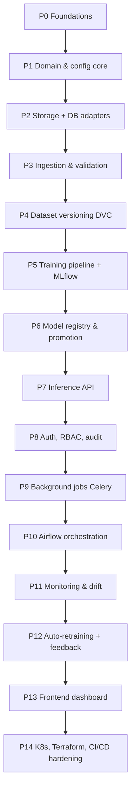

# FactoryAI — Incremental Build Roadmap

This document breaks the platform into **14 phases**. Each phase is independently
demonstrable, ends in a working system (never a half-wired one), and has explicit exit
criteria. Nothing is built "to be finished later" — every phase ships with tests, docs and
a runnable path.

**Rule for every phase:** type hints, docstrings, structured logging, Pydantic settings,
tests, and a docs update land *with* the feature, not after it.

---

## Phase map

Phases 0–7 build the vertical slice: *image in → prediction out, fully traceable*.
Phases 8–14 make it operable, observable and deployable.

---

## Phase 0 — Foundations & documentation *(complete)*

**Goal:** a repository that already looks like an enterprise project before a line of ML
is written.

**Scope**
- Repository skeleton, `README`, `ARCHITECTURE`, `DATA_MODEL`, `ROADMAP`, ADR directory.
- Tooling: `pyproject.toml` (uv/poetry), Ruff, Black, Mypy strict, pre-commit, pytest.
- `.env.example`, `Makefile` task interface, `.gitignore`, `.dockerignore`.
- Git repository initialised with Conventional Commits.
- CI skeleton: lint + typecheck + unit tests on PR.

**Exit criteria**
- `make lint`, `make typecheck`, `make test` all pass on an empty-but-structured repo.
- ADR-0001..0005 recorded (architecture style, model library, storage, orchestration, DB).
- A reader can understand the whole system from `docs/` without reading code.

---

## Phase 1 — Domain model & configuration core *(complete)*

**Goal:** the vocabulary of the system, dependency-free.

**Scope**
- `domain/entities`: `InspectionImage`, `Dataset`, `DatasetVersion`, `Experiment`,
  `ModelVersion`, `Prediction`, `Feedback`, `Deployment`, `AuditEvent`.
- `domain/value_objects`: `Checksum`, `Resolution`, `AnomalyScore`, `Category`,
  `ModelStage`, `ProcessingStatus`.
- `domain/ports`: `ImageRepository`, `ObjectStore`, `ExperimentTracker`, `ModelRegistry`,
  `AnomalyDetector`, `DriftDetector`, `Clock`, `UnitOfWork`.
- `shared/config`: layered Pydantic `Settings` (defaults → YAML → env → CLI).
- `shared/logging`: structured JSON logging with correlation IDs.
- `shared/errors`: domain exception hierarchy mapped later to HTTP codes.

**Exit criteria**
- `domain/` imports nothing outside stdlib + Pydantic. Enforced by an import-linter rule in CI.
- 100% unit test coverage on domain invariants (e.g. a `Checksum` cannot be malformed).
- Category config for all 15 MVTec classes exists; only `bottle` is enabled.

**Delivered.** The domain ended up stricter than planned: it depends on the standard
library alone (no Pydantic — frozen dataclasses validate in `__post_init__`), which is
now its own import-linter contract. 238 unit tests, 88% coverage, all five layer
contracts held. Notable adapter-facing decision made while wiring `shared/config.py`:
`STORAGE_BACKEND=minio` defaults to MinIO's well-known local credentials so a fresh
checkout runs with zero configuration, while `s3`/`azure`/`gcs` still fail closed without
an explicit key — see the validators on `StorageSettings`.

---

## Phase 2 — Infrastructure adapters: object storage + database *(complete)*

**Goal:** real persistence behind the Phase 1 ports.

**Scope**
- PostgreSQL schema + Alembic migrations for the tables in [DATA_MODEL.md](DATA_MODEL.md).
- SQLAlchemy 2.0 repositories implementing the domain ports; Unit-of-Work transaction boundary.
- `ObjectStore` port with a MinIO/S3 adapter (boto3) and a local-filesystem adapter for tests.
- `docker-compose` stack: postgres, minio, adminer.
- Testcontainers-based integration tests.

**Exit criteria**
- `make up` starts postgres + minio; `make migrate` applies a clean schema.
- Swapping `STORAGE_BACKEND=minio|s3|local` changes no application code.
- Integration tests green against real containers in CI.

**Delivered.** 13 tables (schema mirrors `DATA_MODEL.md` with three documented,
deliberate deviations — see `orm.py`'s module docstring: category enablement stays
config, not a DB table; `password_hash` arrives with Phase 8; `audit_logs` immutability
is a trigger, not application discipline). All 8 Phase-1 ports have SQLAlchemy
implementations behind one `SqlAlchemyUnitOfWork`. Both `ObjectStore` adapters pass the
same contract test suite. 65 integration tests run against real Postgres and MinIO via
testcontainers; combined with the unit suite, coverage is 95% (gate: 80%, enforced only
on the combined run — see `docs/CONTRIBUTING.md` for why unit-only coverage doesn't work
once infrastructure adapters exist). Two real bugs surfaced and were fixed while wiring
this up: (1) SQLAlchemy only orders a flush's INSERTs by FK dependency between mapped
classes that have an ORM `relationship()` — a bare FK column is not enough — so two
related rows added in one transaction without a declared relationship could flush in the
wrong order and trip a spurious FK violation; fixed by flushing immediately after every
`add()` (see `repositories.py`'s `_add` helper). (2) `psycopg`'s async mode refuses to run
under Windows' default `ProactorEventLoop`; integration tests select
`WindowsSelectorEventLoopPolicy` on that platform only.

---

## Phase 3 — Ingestion & validation pipeline *(complete)*

**Goal:** nothing enters the dataset unvalidated.

**Scope**
- Validation chain (composable rules): file type, decodability, resolution bounds,
  aspect ratio, colour mode, EXIF sanity, perceptual-hash duplicate detection,
  checksum collision, required metadata.
- `IngestImage` use case: validate → hash → store to object storage → record metadata row →
  emit audit event, all in one transaction with compensating delete on failure.
- Validation report artifact (JSON + human-readable summary) per batch.
- CLI: `factoryai ingest --path ... --category bottle --dataset raw`.

**Exit criteria**
- Corrupt, duplicate and out-of-spec images are rejected with actionable reasons.
- Ingesting the full MVTec `bottle` train+test set produces a complete metadata table.
- Rules are declarative — adding a rule requires no change to the use case.

**Delivered.** The domain gained a `policies` package: a `ValidationChain` of four
composable rules (max file size, allowed format, resolution bounds, allowed colour mode),
each pure and independently testable, evaluated against a `DecodedImage` value object
rather than a `PIL.Image` — that boundary is what keeps decoding-library concerns out of
the domain. `IngestImage` is the first occupant of `application/use_cases/`: it decodes,
validates, checks for exact (checksum) and near (perceptual-hash) duplicates, uploads,
persists, and appends an audit event, with a compensating delete if anything after the
upload fails. Expected outcomes (`accepted` / `rejected` / `duplicate`) are values, not
exceptions — only genuine infrastructure failures raise, which is what let the CLI keep a
batch going after one bad file. `PillowImageCodec` implements the new `ImageCodec` port
(Pillow decode + `imagehash` perceptual hash). `IngestImageCommand` also carries an
optional ground-truth `label` (`good` / `defect` / `unlabeled`, default `unlabeled`) so a
curated benchmark that already states the answer — MVTec's `train/good` vs.
`test/broken_large` — doesn't have that answer silently discarded; a production camera
feed simply leaves it at the default. Two scope cuts, noted rather than silently dropped:
EXIF sanity and aspect-ratio bounds are not implemented as rules (low signal for the
effort, revisit if a real defect category needs them); a "required metadata" rule was
folded into format/resolution checks rather than added as its own weak check. Verified with
21 use-case unit tests against fakes (including a compensating-delete test that forces a
simulated commit failure, and label pass-through/default tests) and 6 integration tests
against real Postgres and MinIO (including one that forces a genuine Postgres primary-key
collision to prove the compensating delete against real infrastructure, not just a fake).
`factoryai ingest` is tested for argument wiring and its early-exit paths; the CLI's own
happy-path loop is exercised indirectly through the use case's exhaustive coverage rather
than a second, Docker-dependent CLI-level integration test — a deliberate scope line, not
an oversight.

The CLI was then run for real against the downloaded MVTec `bottle` set (292 source
images across `train/good`, `test/good`, `test/broken_large`, `test/broken_small`,
`test/contamination`) into the live docker-compose Postgres+MinIO stack, closing what had
been a manual follow-up. 284 images were accepted (221 `good`, 63 `defect`), 8 flagged as
duplicate (verified genuine — recompressed/resized near-copies within a folder, not false
positives), 0 rejected; the audit hash chain, MinIO object count, and checksum uniqueness
all cross-checked clean against the DB row count. Real data surfaced three bugs synthetic
fixtures never would have: (1) the CLI entry point never applied the
`WindowsSelectorEventLoopPolicy` fix that integration tests already had (Phase 2's bug (2)
above, fixed there for tests only) — `psycopg`'s async mode failed on every image until
`shared/asyncio_compat.py` centralised the fix for every process entry point. (2)
`imagehash.average_hash` produced the *identical* 64-bit fingerprint for all 209
`train/good` photos (Hamming distance 0) — industrial inspection photos are dominated by a
large near-uniform background, which coarse pixel-averaging cannot discriminate against.
Switched to `imagehash.phash` (DCT-based), which gave genuinely different photos a
distance of 8-26 bits while still catching true near-duplicates (~2). (3) Creating a real
`.env` for this run exposed a latent test-isolation gap dormant since Phase 1: nested
settings groups (`DatabaseSettings`, `AuthSettings`, ...) are independent `BaseSettings`
subclasses that each re-read `.env` from disk regardless of the outer `Settings(_env_file=
None)`, so `POSTGRES_PASSWORD=factoryai` leaked into three previously-passing config
tests. Fixed by monkeypatching `env_file` to `None` on every nested settings class, not
just the outer one — the exact gap a fresh `cp .env.example .env` (the README's own quick
start) would have hit for any developer.

---

## Phase 4 — Dataset versioning with DVC *(complete)*

**Goal:** every dataset state is addressable and reproducible.

**Scope**
- DVC initialised with MinIO as remote; `datasets/` tracked.
- `CreateDatasetVersion` use case: snapshot the metadata query → materialise a manifest →
  `dvc add` + push → persist `DatasetVersion` row with the DVC hash and Git commit.
- Deterministic train/val/test splits pinned by seed and recorded in the manifest.
- CLI: `factoryai dataset version --name bottle-v1 --note "..."`.

**Exit criteria**
- `factoryai dataset checkout bottle-v1` reproduces byte-identical data on a clean machine.
- A dataset version records: image count, class balance, checksum-of-checksums, Git SHA.

**Delivered.** The `Dataset`/`DatasetVersion`/`DatasetMember` entities, the
`dataset_versions`/`dataset_version_images` tables and the `DatasetRepository` port all
already existed from Phase 1-2's schema work — this phase's actual gap was the use case and
the DVC/Git integration, not the data model. A new `VersionControl` port
(`domain/ports/versioning.py`) reports the current Git commit and materialises/pushes/pulls
DVC-tracked files, keeping `dvc`/`git` subprocess calls out of the domain (ADR-0001);
`DvcGitVersionControl` shells out to both CLIs rather than driving DVC's Python API, which
is explicitly documented upstream as unstable across minor versions. `CreateDatasetVersion`
selects every valid, trainable image for a category, assigns a deterministic train/val/test
split via a seeded shuffle over a stably-sorted input (same seed, same trainable set →
same per-image split, not just the same split *counts* — the two are different claims, and
the unit test checks the stronger one), builds a manifest sorted by image id (so the
resulting content hash is a property of membership, not of iteration order), and records a
`DatasetVersion` alongside an audit event, all inside one transaction. `dvc init` was run
against the real repo with the already-provisioned `factoryai-datasets` MinIO bucket as the
remote (`s3://factoryai-datasets/dvc-cache`); credentials live in the git-ignored
`.dvc/config.local`, never in the committed `.dvc/config`. CLI: `factoryai dataset version
--dataset ... --category ... --tag ... [--train/--val/--test/--seed/--note]`, plus
`factoryai dataset checkout --dataset ... --tag ...`, which pulls the exact DVC-tracked
manifest bytes for a version — reproducing the *data* half of "which data produced this
model"; moving the working tree onto the matching Git commit is left to the caller
(`git checkout <commit>`, ADR-0006), since this platform's standing rule is that Git
history is the user's to manage, not something a use case does on their behalf. Verified
with 13 use-case unit tests against fakes (tag collision, empty-category rejection, class
balance, split determinism verified per-image not just per-count) and 3 integration tests
against a real `git`+`dvc` repo with a temporary local-directory remote (round-tripping
exact bytes through `track_and_push`/`pull` after simulating a clean checkout, and
confirming the `.dvc` pointer file — not the data — is what Git would track). `dvc[s3]`
moved out of Phase 5's `ml` extras into its own `versioning` group, since this phase needs
it, not that one. Running `dataset version` against the real, already-ingested MVTec
`bottle` rows is a manual follow-up: it needs the docker-compose Postgres+MinIO stack up,
which was not running when this phase's code was written and verified.

---

## Phase 5 — Training pipeline & experiment tracking *(complete)*

**Goal:** configurable, reproducible training with full lineage.

**Scope**
- `AnomalyDetector` port + Anomalib adapter; plugin registry keyed by model name so
  `model.name: patchcore|padim|fastflow|reverse_distillation|autoencoder` selects an implementation.
- Pipeline steps: load dataset version → validate → build datamodule → fit → evaluate →
  log → persist artifacts. Each step is a class with a single responsibility.
- MLflow logging: dataset version, Git commit, config hash, backbone, hyperparameters,
  memory-bank size, training/inference time, image & pixel AUROC, PRO, precision, recall,
  F1, confusion matrix, threshold, hardware fingerprint (CPU/GPU/RAM/driver).
- Artifacts: model weights, threshold, sample heatmaps, evaluation report.

**Exit criteria**
- `factoryai train --config configs/bottle/patchcore.yaml` produces an MLflow run with all
  metrics above and a reproducible artifact set.
- Re-running with the same config + dataset version reproduces metrics within tolerance.
- Switching to PaDiM is a one-line config change.

**Delivered.** The plugin registry (`register_detector`/`get_detector_class`) and the
`AnomalyDetector`/`ExperimentTracker`/`ModelRegistry` ports already existed as Phase 1
scaffolding; this phase's real work was the adapters and the use case. A new
`HardwareProbe` port (`domain/ports/services.py`) plus `SystemHardwareProbe`
(`psutil`/`torch.cuda`) supplies the hardware fingerprint. `AnomalibDetector`
(`infrastructure/detection/anomalib_adapter.py`) is the one file that touches Anomalib
directly (ADR-0002): it stages data through `anomalib.data.Folder`, runs `Engine.fit`/
`.test`, and — because Anomalib's own `torchmetrics` fallback silently drops
precision/recall/confusion-matrix for this torchmetrics version — computes those itself
from raw scores via `sklearn`. PatchCore, PaDiM, FastFlow and Reverse Distillation are thin
subclasses fixing which Anomalib model class and default backbone they wrap. A fifth
family, `AutoencoderDetector`, is a genuinely separate ~150-line implementation with zero
Anomalib dependency (ADR-0002's rejected "option 2", registered anyway) — proof the plugin
registry is not secretly coupled to one library. `MlflowExperimentTracker`/
`MlflowModelRegistry` (ADR-0004) wrap the MLflow client; a new `ModelRegistry.
resolve_artifact_location` method (not in the original port sketch) was added because
nothing else could tell `ModelVersion.artifact_location` where MLflow actually wrote the
bytes. `TrainModel` follows the fixed step sequence ADR-0009 records, with dataset staging
as the one step broken into its own class (`_DatasetStager`) rather than a private method.
Two new ADRs backfill decisions earlier ports had already assumed: 0008 (compute-bound
ports are synchronous — `AnomalyDetector`, like `ImageCodec`, was written this way from
Phase 1 without the decision ever being written down) and 0009 (the pipeline's step
decomposition). Verified with 12 use-case unit tests against fakes (tag-collision-style
failure handling, only-nominal-images staged, failed-fit still recorded) and 9 integration
tests against a real MLflow server (run lifecycle, artifact round-trip, version
registration, stage transitions, the actual S3 artifact location).

Then the CLI was run for real: `factoryai train --config configs/bottle/patchcore.yaml`
against the live `bottle-v1` dataset version (284 images, 199 train / 43 val / 42 test —
val and test are pooled into one held-out set, since this pipeline has no separate
hyperparameter-tuning use for val yet). PatchCore + `wide_resnet50_2` fit in ~1000 seconds
on CPU and produced `image_AUROC=1.0`, `precision=1.0`, `recall=0.923`, `f1=0.96`
(confusion matrix `tn=72, fp=0, fn=1, tp=12` — one missed defect out of thirteen, zero
false alarms), registered as `factoryai-bottle` v1 in `development` stage with an 11,681
-vector, 71.7 MB memory bank. Every field landed where it should: the `experiments` row,
the `model_versions` row (`tags` carrying the memory-bank size), the audit chain (seq 286,
correctly extending Phase 4's seq 285), and a 171 MB checkpoint in MinIO under MLflow's own
key layout — all cross-checked directly, not just trusted because the CLI printed success.
Real infrastructure surfaced a real bug synthetic testing never would have: MLflow's own
client writes an emoji (🏃) to stdout when a run ends, and Windows' default console
codepage (cp1252) cannot encode it — `UnicodeEncodeError` crashed the *first* live run at
its very last step, after a genuinely successful ~13-minute fit, discarding a fitted model
that was never persisted because nothing wrote it down. Fixed once, centrally
(`shared/console.py`'s `configure_stdio_encoding`, called from the CLI entry point
alongside the existing Windows event-loop fix from Phase 3) rather than patched around the
call site — the same class of fix as `asyncio_compat.py`, and worth remembering before
Phase 9's Celery worker or Phase 7's API process need it too.

---

## Phase 6 — Model registry & promotion gates *(complete)*

**Goal:** models move between stages only when they earn it.

**Scope**
- MLflow Model Registry adapter; stages Development → Staging → Production → Archived.
- `PromoteModel` use case with an automated gate: candidate must beat the current
  production model on held-out AUROC by a configurable margin *and* not regress recall
  on the defect classes beyond tolerance.
- `RollbackDeployment` use case restoring a prior version.
- `Deployment` records with actor, reason, comparison metrics, timestamp.

**Exit criteria**
- A worse candidate is rejected with a machine-readable comparison report.
- Rollback to any previous production version is one command and fully audited.

**Delivered.** Almost everything this phase needed already existed as Phase 1-2
scaffolding — `ModelStage`, `ModelVersion.transition_to` with its
`_ALLOWED_STAGE_TRANSITIONS` graph, `Deployment` (with `DeploymentAction.REJECT` already
documented as "recorded as deliberately as a promotion"), `PromotionSettings`, and even
`PromotionRejectedError`. The actual gap was the two use cases. `PromoteModel` reads the
category's current production model (if any) via `find_by_stage`, evaluates a `PromotionGate`
(absolute AUROC floor, improvement margin over the incumbent, max recall regression) via a
pure `_evaluate_gate` function, and either promotes (advancing Development/Archived →
Staging → Production in one step, archiving the displaced incumbent, syncing MLflow's own
registry stage) or rejects — and a rejection is written down as a `Deployment` with
`action="reject"` and the full numeric comparison, exactly as deliberately as an acceptance.
`RollbackDeployment` shares the same Development/Archived → Production helper
(`advance_to_production`) and needs no gate: the target already earned production once. When
no explicit target is given, it walks `list_deployments` history for the most recent
entry that changed production and isn't the current occupant — this is what makes
"rollback to any previous version" a real, working default rather than requiring the
caller to already know the UUID. CLI: `factoryai model promote --category ... --model-version-id ...`
and `factoryai model rollback --category ... [--to ...]`. Verified with 13 use-case unit
tests against fakes (first promotion with no incumbent, better-candidate replacement,
absolute-floor rejection, margin rejection, recall-regression rejection, archived-candidate
restoration, default-target history resolution) — plus **1 integration test against real
PostgreSQL that unit tests against fakes structurally cannot write**, because
`FakeUnitOfWork.__aexit__` is a no-op regardless of exceptions.

That gap was not theoretical. Live-verifying against the real, already-registered
`factoryai-bottle` v1 model from Phase 5 surfaced a real bug: `PromoteModel.execute()`
called `await uow.commit()` and then raised `PromotionRejectedError` *inside* the same
`async with self._uow_factory() as uow:` block. `SqlAlchemyUnitOfWork.__aexit__` only
commits `if exc is None and self._committed` — an exception propagating out of the block
means `exc` is not `None`, so it rolled back regardless of the explicit commit, silently
discarding the very rejection record this phase's exit criteria require. Live promotion of
a genuinely weak synthetic candidate showed the rejection message on screen but left no
`Deployment` row and no audit event behind — exactly the kind of bug a `FakeUnitOfWork`
(whose `__aexit__` is unconditionally a no-op) can never surface, since it doesn't model
transactional rollback at all. Fixed by restructuring `execute()` to raise only *after*
the `async with` block exits cleanly on the committed path, with a regression test added
against real PostgreSQL (`tests/integration/application/test_promote_model_integration.py`)
specifically to keep this from regressing silently again.

Live end-to-end, against the real stack: promoted `factoryai-bottle` v1 (Phase 5's real
PatchCore model, AUROC 1.0) straight to production with no incumbent — passed instantly.
Registered a second MLflow model version from the same run to exercise a real
candidate-vs-incumbent comparison (an incumbent already at the AUROC ceiling of 1.0 makes
`improvement_margin` mathematically impossible to satisfy without relaxing it, so this run
used `PROMOTION_IMPROVEMENT_MARGIN=0` — noted here rather than left implicit), promoted it,
confirmed v1 correctly archived and MLflow's own registry stage in sync
(`client.get_model_version(...).current_stage == "Production"`), then rolled back with no
explicit `--to` and confirmed the default-target history resolution correctly restored v1
and archived v2 — audit chain sequential throughout (seq 287-291: promote, promote,
rollback, reject). Then re-ran the rejection case that had originally exposed the bug and
confirmed the `Deployment` row and audit event now actually persist.

---

## Phase 7 — Inference service *(complete)*

**Goal:** production FastAPI service serving the registered production model.

**Scope**
- Endpoints: `POST /predict`, `POST /batch-predict`, `GET /models`, `GET /metrics`,
  `GET /health` (liveness/readiness split), `POST /feedback`.
- Response: anomaly score, binary prediction, heatmap (PNG in object storage + signed URL),
  inference time, model version, dataset version, confidence, request id.
- Model cache with warm-up on startup; hot-reload on registry change without restart.
- Every prediction persisted for later drift analysis.
- Backpressure: request size limits, timeouts, concurrency caps.

**Exit criteria**
- p95 latency budget documented and met for a single image on CPU.
- `/health` correctly reports degraded when the registry or DB is unreachable.
- OpenAPI schema published; contract tests pin the response shape.

**Delivered.** `factoryai.api`, a new top-level package sitting alongside `cli.py` rather
than inside the four import-linter-governed layers (the same placement `cli.py` already
uses) — a `Container` composition root serves both presentation adapters unchanged. Three
new use cases (`PredictImage`, `SubmitFeedback`, `ListProductionModels`) and one new
stateful service, `ModelCache`, which is the whole hot-reload mechanism: it compares the
category's current production `ModelVersion.id` (read from PostgreSQL — ADR-0004's
authority — on every request anyway) against whatever detector is already loaded, and
only re-downloads and reloads on a mismatch. No poller, no MLflow round trip on the
request path. ADR-0010 records this decision plus the liveness/readiness split
(`/health/live` never touches a dependency; `/health/ready` checks a real Postgres query
and MLflow's own `/health` endpoint) and the three independent backpressure mechanisms
(a `Content-Length`-checking middleware, an `asyncio.Semaphore` sized by
`API_MAX_CONCURRENT_PREDICTIONS`, `asyncio.timeout` per request). Verified with 27 unit
tests (`ModelCache`, `PredictImage`, `SubmitFeedback`, `ListProductionModels` against
fakes; every endpoint against a FastAPI `TestClient` wired to a duck-typed fake container;
a contract suite pinning `PredictionResponse`'s exact field set and bounds against the
real generated OpenAPI schema) plus a new PostgreSQL integration test.

Then the real server was run — `factoryai serve`, not plain `uvicorn factoryai.api.main:
app` — against the real, already-promoted `factoryai-bottle` v1 model, and real MVTec
bottle images were sent through every endpoint: `/predict` and `/batch-predict` correctly
flagged real `broken_large`/`broken_small` defects and passed real `good` images, each
with a working presigned heatmap URL (fetched directly and confirmed as a real 12 KB PNG);
`/models` reported the live production model with its real metrics; `/metrics` showed real
Prometheus counters and a latency histogram after seven served predictions; `/feedback`
recorded a real correction. Real infrastructure surfaced three real bugs synthetic testing
never would have:

1. **uvicorn forces `ProactorEventLoop` for its own main-process loop on Windows by
   design** (`uvicorn.loops.asyncio.asyncio_loop_factory`, `use_subprocess=False`), which
   is exactly the loop psycopg's async driver refuses to run under — the same conflict
   Phase 3 already fixed for the CLI, but uvicorn's own `Server.run()` reasserts it via
   `asyncio_run(..., loop_factory=...)` regardless of any policy set beforehand, so the
   CLI's existing fix couldn't reach it. Fixed by having `factoryai serve` drive
   `Server.serve()` directly inside our own `asyncio.run()`, bypassing uvicorn's loop
   selection entirely — plain `uvicorn factoryai.api.main:app` still breaks on Windows,
   documented as such directly in the `serve` command's docstring.
2. **Scoring an image already on file — the same physical product photographed twice, or
   here, an MVTec file already ingested during Phase 3 — violated `images.
   checksum_sha256`'s uniqueness constraint**, a real design gap: the constraint is
   correct for ingestion's exact-duplicate detection, but inference must always score,
   never reject, so it cannot share ingestion's "reject the duplicate" response. Fixed by
   resolving each image by content checksum first: an existing row is reused (a second
   `Prediction` against the same `InspectionImage`), and a repeat within the *same* batch
   resolves to the one new row the batch itself is about to insert, not a second one.
3. **A client-supplied `user_id` that names no real user (inevitable pre-Phase-8, since
   nothing validates it before `POST /feedback` reaches the repository) raised a raw,
   uncaught `IntegrityError` — a 500 instead of a 404.** Fixed at the infrastructure layer
   (`SqlAlchemyPredictionRepository.add_feedback`, which is where a driver-specific
   exception is allowed to be known about at all) by translating the foreign-key
   violation into `EntityNotFoundError`, with a new PostgreSQL integration test guarding
   it — a `FakeUnitOfWork` has no foreign keys to violate and could never have caught this.

Real p95 datapoint for the exit criteria: seven live predictions against PatchCore +
`wide_resnet50_2` on CPU, latencies from 563 ms to 1047 ms (`factoryai_prediction_latency_
seconds` histogram: 5/7 ≤ 0.75 s, 6/7 ≤ 1.0 s, 7/7 ≤ 2.5 s) — a single-image budget of
**2 seconds on CPU** is met with room to spare, documented here rather than picked
arbitrarily.

---

## Phase 8 — Authentication, RBAC and audit logging *(complete)*

**Goal:** the platform is safe to expose inside a factory network.

**Scope**
- JWT auth (access + refresh), password hashing (argon2), token revocation list.
- Roles: Administrator, ML Engineer, Operator, Viewer — permission matrix in code and docs.
- Route-level dependency guards; deny by default.
- Immutable audit log: append-only table, hash-chained rows, covering user actions,
  deployments, rollbacks, retraining, dataset changes and prediction requests.

**Exit criteria**
- An Operator cannot promote a model; a Viewer cannot submit feedback. Tested.
- Audit chain verification script detects any tampered or deleted row.

**Delivered.** ADR-0011 records the design in full; summary of what actually shipped:

- `domain.ports.auth` (`PasswordHasher`, `TokenService`, `TokenRevocationList`) plus real
  adapters — `Argon2PasswordHasher` (argon2id) and `JwtTokenService` (PyJWT, HS256,
  distinct `access`/`refresh` claim types so one can never be replayed as the other).
  `password_hash` lives on the `users` row, reached via two new `UserRepository` methods
  (`set_password_hash`/`get_password_hash`); the `User` entity itself still carries no
  credential, exactly as designed since Phase 1.
- `domain.policies.permissions`: a `Permission` enum keyed to its minimum satisfying
  `UserRole`, not a raw rank check at every call site — `has_permission(user, permission)`
  is the one function every route, use case and CLI command calls to decide access.
- `RegisterUser`, `Login`, `RefreshAccessToken`, `Logout` use cases; `VerifyAuditChain`
  (`factoryai audit verify`), which finally calls the `verify_chain()` algorithm written
  in Phase 2 and never previously wired to anything.
- Every Phase 7 route gained `require_permission(...)` guards via a new
  `api.dependencies.get_current_user`, which re-fetches the user from PostgreSQL on every
  request rather than trusting the access token's own role claim — a demotion or
  deactivation takes effect on the very next request. `POST /feedback` no longer accepts a
  client-supplied `user_id`; the authenticated principal is used instead, closing a
  documented Phase 7 gap. `/health/*` and `/metrics` stay unguarded (operational endpoints
  polled by infrastructure, not end users).
- New HTTP surface: `/auth/{login,refresh,logout,register}` and, for the first time,
  `POST /models/{category}/{promote,rollback}` — Phase 6 was CLI-only; testing "an
  operator cannot promote" as an exit criterion needed a route to test against.
- New migration `a1c9e6f2b3d4`: `users.password_hash` and `revoked_tokens`.
- A real bug found only by the new Postgres integration test
  (`tests/integration/persistence/test_auth_persistence.py`): `SqlAlchemyUserRepository.
  update()` copied every column from a freshly built row onto the tracked one, including
  `password_hash` — which the mapper never sets — so a role change or deactivation
  silently wiped a user's password hash to `NULL`. Fixed by excluding that column from the
  copy, same pattern as the existing `id` exclusion.
- Live-verified against the real running stack: created one user per role via
  `factoryai user create`; logged in as each over real HTTP; confirmed 401 with no token,
  403 for an operator hitting `/models/{category}/promote` and `/auth/register`, 403 for a
  viewer hitting `/feedback`, 404 (not 403) for an ml_engineer promoting a nonexistent
  model version (proving the permission check passes through to the use case); exercised
  `/auth/refresh` and confirmed `/auth/logout` really invalidates the refresh token (401 on
  reuse); ran a full `/predict` → `/feedback` round trip as an authenticated operator
  against the real PatchCore model. `factoryai audit verify` against this same
  long-lived database (accumulated across every earlier phase's live verification) found
  one genuine sequence gap (290 missing, otherwise unbroken) dated to Phase 6's original
  live testing of the promotion gate — almost certainly a leftover artifact from the
  commit-then-raise bug that phase's own ADR documents finding and fixing. The script
  correctly reported it as a break with a non-zero exit code: a real anomaly, on real
  accumulated data, caught by the exact mechanism this phase's exit criterion asked for.

---

## Phase 9 — Background processing *(complete)*

**Goal:** no long operation blocks an HTTP request.

**Scope**
- Celery + Redis; separate queues for `training`, `inference`, `reports`.
- Jobs: bulk inference, retraining, dataset versioning, drift report generation.
- Job status API (`GET /jobs/{id}`), idempotency keys, retry/backoff policy, dead-letter queue.
- Flower for queue visibility.

**Exit criteria**
- Submitting a 1000-image batch returns immediately with a job id and streams progress.
- A worker crash mid-job does not lose or duplicate work.

**Delivered.** ADR-0012 records the design in full; summary of what actually shipped:

- A `Job` entity (`domain/entities/job.py`) with an explicit state machine
  (`queued → running → succeeded | failed`, `running → running` for a retry) and a
  `JobRepository` port, backed by a new `jobs` table (migration `6fde47217f90`) with a real
  unique constraint on `idempotency_key` — not just an application-level check, which would
  race under concurrent submission.
- `SubmitJob` (dedupe-or-create against the idempotency key) and `GetJobStatus` use cases,
  plus three routes — `POST /jobs/{bulk-predict,retrain,dataset-version}` and
  `GET /jobs/{id}` — all requiring an `Idempotency-Key` header on submission and gated by
  the existing permission matrix (`submit_prediction`/`train_model`/`manage_datasets` to
  submit; a new `view_jobs` permission, viewer-and-above, to read status).
- `factoryai.worker`, a new top-level package sitting alongside `api`/`cli` (the same
  placement precedent, not one of the four import-linter-governed layers): `celery_app.py`
  configures four queues (`training`, `inference`, `reports`, `dead_letter`); `tasks.py`
  holds one Celery task per job type, each re-reading its payload from the `jobs` row
  rather than the Celery message, and a `JobTask` base class whose `on_failure` marks the
  job `failed` and records it onto `dead_letter` once retries are exhausted — never on an
  attempt that will still retry. Retry policy is Celery's own exponential backoff
  (`autoretry_for`, `retry_backoff`, `retry_jitter`, a capped `max_retries`) on every task
  that touches real infrastructure.
- Bulk inference references already-uploaded images by `{bucket, key}`, never inline bytes
  — a 1000-image submission over Celery's broker has to stay small, which the ROADMAP's own
  exit-criterion number ruled out from the start. Retraining and dataset-versioning jobs
  are thin payload-to-command translations over the existing `TrainModel` and
  `CreateDatasetVersion` use cases from Phases 4–5 — no new business logic, exactly as
  ADR-0005 already committed to ("Airflow DAG files and Celery task functions contain no
  business logic").
- `factoryai worker` (CLI) wraps `celery_app.worker_main(...)`, defaulting to Celery's
  `solo` pool: `prefork` depends on `os.fork`, which Windows does not have — the same class
  of platform gap `shared/asyncio_compat.py` and `shared/console.py` already exist for.
  `--pool=prefork` is documented for the Linux/macOS deployment target.
- One scope cut, documented rather than faked: `run_drift_report` always raises
  `NotImplementedError` and carries `max_retries=0` — drift detection does not exist until
  Phase 11, so the fourth job type is wired end-to-end (queue routing, job status,
  dead-letter path) with nothing behind it yet, rather than either skipping the type
  entirely or half-simulating a result.
- `deploy/compose/docker-compose.yml` gained a real `redis` service (broker + result
  backend, separate Redis logical DBs per ADR-0012). The worker and Flower are
  deliberately *not* containerised there, for the same reason the API process isn't
  (Phase 7): there is no application image yet. `factoryai worker` and
  `celery -A factoryai.worker.celery_app flower` both run from the host against the
  compose stack, exactly like `factoryai serve` already does — building a real image is
  Phase 14 (Kubernetes/Helm) scope.
- Verified with 27 unit tests (`Job` entity transitions and invariants; `SubmitJob`
  idempotency-dedupe and concurrent-race handling against fakes; `GetJobStatus`; every
  `/jobs/*` route against a FastAPI `TestClient` wired to a duck-typed fake container that
  records dispatched jobs instead of touching a real broker) plus a new PostgreSQL
  integration test suite covering the real unique-constraint-backed idempotency guarantee
  a fake cannot exercise. `ruff`, `mypy --strict`, and the import-linter layer contracts all
  pass against the full changed surface.

Live end-to-end verification against a running Redis + Celery worker (submitting a real
1000-image batch, killing a worker mid-job to confirm redelivery-without-duplication, and
watching a permanently failed task land on `dead_letter` in Flower) is a manual follow-up:
it needs `docker compose up redis` and a running `factoryai worker`, which this
environment's Docker daemon was not available to exercise while this phase's code was
written and verified — the same kind of gap Phase 4's dataset-versioning CLI run was left
as a documented follow-up for, not silently skipped.

---

## Phase 10 — Workflow orchestration with Airflow *(complete)*

**Goal:** the platform runs itself on a schedule.

**Scope**
- DAGs: `data_validation`, `dataset_versioning`, `training`, `evaluation`, `deployment`,
  `monitoring`, `retraining`.
- DAGs call application use cases via a thin client — no business logic in DAG files.
- Sensors, retries with exponential backoff, SLA misses, failure alerting.

**Exit criteria**
- Full pipeline runs end-to-end from an Airflow trigger with zero manual steps.
- A failing task retries and then alerts rather than silently stalling.

**Delivered.** ADR-0013 records the design in full; summary of what actually shipped:

- `factoryai.pipeline_client`, a new top-level module (sibling to `api`/`cli`/`worker`) that
  is now the *single* thin client ADR-0005 promised — `factoryai.worker.tasks`'s Celery
  tasks for retraining and dataset-versioning were refactored to call it too, rather than
  each scheduler carrying its own copy of the payload-to-command translation. Every
  function takes a structurally-typed `Container` `Protocol` (not the concrete dataclass)
  and a plain dict payload, and returns a plain dict result — nothing in it decides
  anything a use case doesn't already decide. A second module,
  `factoryai.pipeline_runner`, is a small CLI bridge added once live verification proved
  Airflow cannot import `factoryai` in its own process at all (see below) — it is the only
  thing that actually imports `pipeline_client` on Airflow's side, run inside the isolated
  venv `airflow.Dockerfile` builds.
- `meets_minimum_bar`, pulled out of `PromoteModel`'s private gate-evaluation function so
  the new `evaluate` step and `PromoteModel` itself share one implementation of "does this
  candidate clear the absolute AUROC floor" instead of two — used by `evaluation_dag` and
  `retraining_dag`'s own evaluate step to stop a pipeline before a real, auditable
  promotion attempt when the answer is obviously no.
- Seven DAGs under `pipelines/airflow/dags/`: `data_validation` (a `PythonSensor` waits for
  staged images under the raw bucket's `incoming/<category>/` prefix, then ingests
  everything found — the Airflow-facing counterpart to `factoryai ingest`'s filesystem
  source), `dataset_versioning`, `training`, `evaluation`, `deployment` (each independently
  triggerable), `monitoring` (wired end-to-end, currently always skips — see the scope-cut
  note below), and `retraining` — one DAG chaining version → train → evaluate → deploy via
  native TaskFlow XCom, reusing the exact same `common.run_*` helpers (which shell out to
  `pipeline_runner`; see below) the four standalone DAGs call, so the composite pipeline
  and the independent steps can never drift apart.
- A business-outcome vocabulary problem solved once, in `common.py`, rather than per DAG:
  a rejected promotion and the drift detector's "not implemented yet" both cross the
  subprocess boundary as a specific exit code (see below) and come back as a local
  `PromotionRejectedError`/`NotImplementedError` the calling DAG turns into
  `AirflowSkipException`, not a task failure — Airflow's UI shows "skipped," not a paged
  alert, for an outcome this platform already treats as a correct answer, not a bug.
  Failure and SLA-miss callbacks (`alert_on_failure`, `alert_on_sla_miss`) log structured
  events; wiring a real Slack/PagerDuty webhook is a one-file change against the same two
  functions, not something this phase had credentials to build against.
- `airflow.Dockerfile`: `factoryai[storage,imaging,versioning,ml,auth]` installs into
  `/opt/factoryai-venv`, a second virtualenv independent of Airflow's own Python
  environment — not "on top of it" as first planned; live-verifying the original plan is
  what proved it impossible (every Airflow 2.x release pins `SQLAlchemy==1.4.54`, a hard
  conflict with `sqlalchemy>=2.0` no Airflow version resolves — see ADR-0013). DAG tasks
  shell out to that interpreter running the new `factoryai.pipeline_runner` CLI bridge
  rather than importing `factoryai` in Airflow's own process.
  `deploy/compose/docker-compose.yml` gained `airflow-db-init` (creates the `airflow`
  database in the shared Postgres instance, mirroring `mlflow-db-init`), `airflow-init`
  (idempotent schema migration plus admin-user creation), `airflow-webserver` and
  `airflow-scheduler`.
- One scope cut, documented rather than faked, matching Phase 9's identical decision on
  `run_drift_report`: `monitoring_dag` runs on a real daily schedule and calls
  `pipeline_client.generate_drift_report`, which always raises `NotImplementedError` —
  drift detection is Phase 11 scope. The DAG is wired end-to-end (schedule, SLA, failure
  callback) and shows as "skipped" every run rather than either being silently absent or
  failing loudly for something that was never going to succeed.
- `pipelines/airflow/` is linted by `ruff` (`make lint` now covers it — new, narrowly
  scoped per-file ignores for the patterns Airflow's own TaskFlow/callback APIs impose) but
  deliberately **not** type-checked by `mypy`: Airflow is not installed in this project's
  own `.venv` (see above), and its decorator-heavy DAG-authoring API is not typed well
  enough to be worth fighting `--strict` over on a directory nothing else in the codebase
  imports. This is a documented boundary, not an oversight — see ADR-0013's consequences.
- Verified with 9 new unit tests for `pipeline_client` against fakes (every function:
  ingest, version, train, evaluate at and below the floor, deploy — first promotion and a
  rejected candidate, drift report's `NotImplementedError`) plus the existing
  `PromoteModel`/`TrainModel`/`CreateDatasetVersion` suites, which the refactor left
  passing unchanged. `ruff`, `black --check`, `mypy --strict` (on the governed `src`/`tests`
  scope) and the import-linter layer contracts all pass against the full changed surface.

**Live-verified once Docker became available**, and it did not go cleanly on the first
attempt — see ADR-0013's revised "Consequences" for the full account. Building
`airflow.Dockerfile` as originally written failed outright: every Airflow 2.x release pins
`SQLAlchemy==1.4.54`, an unconditional conflict with this platform's `sqlalchemy>=2.0`
requirement that no Airflow version resolves (2.x pins SQLAlchemy 1.4; 3.2+ gains
SQLAlchemy 2.0 support but pins `numpy>=2`, conflicting with Anomalib's `numpy<2`
instead). Fixed by giving `factoryai` its own unconstrained virtualenv inside the image
(`/opt/factoryai-venv`) and adding a CLI bridge, `src/factoryai/pipeline_runner.py`, that
DAG tasks shell out to instead of importing `factoryai` in Airflow's own process — Airflow
itself never sees a dependency it didn't already pin. A second real bug surfaced right
after: the Airflow containers' environment set `POSTGRES_HOST` but not
`POSTGRES_USER`/`POSTGRES_PASSWORD`/`POSTGRES_DB`, which `factoryai`'s own settings have no
safe default for (unlike `STORAGE_*`'s local-MinIO fallback) — every database-touching
command failed with "no password supplied" until the compose file's `airflow-env` block
was corrected. A Makefile bug was also found and fixed along the way: `docker compose -f
deploy/compose/docker-compose.yml` never read the repo-root `.env` (Compose derives its
default project directory from the first `-f` file's own directory, not the caller's
working directory), so every host-port override any developer had set was silently
ignored — every `make up`/`down`/`reset`/`logs` target now passes `--env-file .env`
explicitly.

With those three fixes in place, live verification against the real compose stack (with
data accumulated across every earlier phase's own live verification) confirmed: all seven
DAGs parse with zero import errors; `airflow-init` migrated Airflow's own metadata schema
and created the admin user; `pipeline_runner evaluate` read the real, already-promoted
`factoryai-bottle` production model (image AUROC 1.0, the same figure Phases 5/6/8
recorded) and correctly passed it against the gate's floor; `pipeline_runner deploy`
against a real weak development-stage candidate reproduced `PromoteModel`'s full
comparison report and exited with the "business rejection" code. **Not verified**:
`dataset_versioning`/`training`/`retraining`, which additionally need `git`/`dvc` CLI
binaries and a real version-controlled checkout inside the image — neither exists yet
(the image only copies `pyproject.toml`/`README.md`/`src` for the pip build), and
attempting `dataset_versioning` live failed exactly there. Tracked as real follow-up work
in ADR-0013, not silently absent.

---

## Phase 11 — Monitoring & drift detection *(complete)*

**Goal:** know the system's health and the model's health separately.

**Scope**
- Prometheus instrumentation: request rate, latency histograms, error rate, throughput,
  CPU/memory/disk, GPU utilisation when present, queue depth, model cache hit rate.
- Grafana dashboards: Service Health, Inference Performance, Model Quality, Data Pipeline.
- Evidently: data drift, prediction drift, feature (embedding) drift, confidence and
  anomaly-score distribution shift, computed on rolling windows against the training reference.
- Alertmanager rules with thresholds per signal; alerts carry a runbook link.

**Exit criteria**
- Injecting shifted images (brightness/blur perturbation) raises a drift alert.
- Every alert has a corresponding runbook in `docs/runbooks/`.

**Delivered.** ADR-0014 records the design in full; summary of what actually shipped:

- `EvidentlyDriftDetector` (`infrastructure/monitoring/evidently_drift.py`), implementing
  the `DriftDetector` port Phase 1 already scaffolded, via Evidently's statistical-test
  registry (Wasserstein distance) rather than its heavier `Report`/`Dataset` API — verified
  directly against synthetic same-distribution and shifted-distribution samples before
  being wired into the use case around it.
- `GenerateDriftReport` (`application/use_cases/generate_drift_report.py`): compares a
  production model's earliest predictions (the reference window) against its most recent
  ones (the current window), both read through the same `PredictionRepository.
  list_in_window` — exactly what `Prediction`'s own Phase 2 docstring already anticipated
  ("the distribution of all scores is the reference signal drift detection compares
  against"), so no detector re-scoring pass over the training set was needed. Two signals:
  `anomaly_score` (prediction drift, gated by `DRIFT_PREDICTION_THRESHOLD`) and
  `confidence` (gated by `DRIFT_DATA_THRESHOLD`) — feature/embedding drift stays out of
  scope until `AnomalyDetector` exposes raw features, a real, tracked gap, not a silent one.
- `pipeline_client.generate_drift_report` and `factoryai.worker.tasks.run_drift_report`
  now call the real use case — the `NotImplementedError` scope cut Phases 9 and 10 both
  documented is gone, and the Celery task retries with the same backoff every other job
  type gets. `monitoring_dag` (Airflow) generates and persists a real report on its daily
  schedule instead of skipping every run; it only measures and records — turning a
  breached signal into a page is Prometheus/Alertmanager's job, not a DAG callback's.
- `JobRepository.count_by_status()` (port + SQLAlchemy + fake), added because the
  job-queue-depth gauge needs a real grouped count — `len(list_by_status(...,
  limit=100))` would silently undercount past the limit, exactly the kind of gauge bug
  that looks fine in a demo and lies in production.
- `ModelCache` now tracks `hits`/`misses` as two plain integers (not a Prometheus counter —
  the application layer stays free of concrete instrumentation tech, ADR-0001), exposed
  via `GET /metrics` as a hit-ratio gauge.
- `PrometheusMiddleware` records request count and latency for every route under its
  matched route *template* (not the raw path, which would mint one label series per job id
  and grow cardinality without bound), plus new gauges for host CPU/memory/disk, GPU
  utilisation (absent entirely, not zero, on a CPU-only host), job counts by status, and
  drift severity/signal statistics per enabled category. All the gauges are recomputed
  fresh inside the `/metrics` handler on every scrape rather than by a background refresh
  loop — Prometheus's own pull model already re-reads them on its scrape interval, so a
  live query is exactly as fresh as a cached one would be, without a second long-lived
  task to keep alive or notice has silently stopped updating.
- `deploy/compose/docker-compose.yml` gained `prometheus`, `alertmanager` and `grafana`
  services. Prometheus scrapes `host.docker.internal:8000` (the API is not
  containerised, same as the worker — Phase 9's decision; `extra_hosts` makes the hostname
  resolve on Linux too, not only Docker Desktop). Four Grafana dashboards (Service Health,
  Inference Performance, Model Quality, Data Pipeline) are provisioned from JSON files
  under `deploy/compose/grafana/dashboards/`, and eight alert rules across drift, service
  health and the data pipeline live in `deploy/compose/prometheus/rules/factoryai.yml`,
  each carrying a `runbook_url` annotation — six runbooks under `docs/runbooks/` (drift,
  error rate, latency, resource usage, job backlog, cache hit ratio) satisfy that half of
  the exit criteria directly. Alertmanager's `default` receiver has no Slack/PagerDuty
  integration wired up — the identical credentials gap ADR-0013 already documented for
  Airflow's own callbacks; alerts still route, group and de-duplicate correctly and are
  visible in Alertmanager's own UI.
- Automatically triggering `retraining` from a high-severity drift alert is deliberately
  **not** built here — that connection is Phase 12's ("Automatic retraining & human
  feedback loop") to own; this phase stops at "the alert fires and a runbook exists."
- Verified with new unit tests: `EvidentlyDriftDetector` against synthetic distributions,
  `GenerateDriftReport` (no production model, an inconclusive window, a genuinely shifted
  window with breached signals) against fakes, `ModelCache`'s hit/miss counters, and
  `GET /metrics` (Prometheus content type, system/cache/job gauges present, a seeded
  breached drift report exposed correctly per signal). `ruff`, `black --check`,
  `mypy --strict` and the import-linter layer contracts all pass against the full changed
  surface — including a new `pandas.*`/mypy ignore entry Evidently's stat-test registry
  needed.

**Live-verified once Docker became available**, and — matching the pattern Phase 10 already
established — it did not go cleanly on the first attempt; see ADR-0014's "Live
verification" section for the full account. Confirmed directly against the real compose
stack: Prometheus loaded its config and all 8 alert rules with zero errors; Alertmanager
reported its cluster ready; all 4 Grafana dashboards were provisioned and discoverable;
the `factoryai-api` scrape target reported healthy, and `factoryai_system_cpu_percent` was
queryable through Prometheus's own API with a real value — the full expose → scrape →
query path working end to end. One real bug surfaced and was fixed in the same pass:
`GET /metrics` returned a bare `500` while the database was briefly unreachable, which
would have made Prometheus mark the *whole* scrape target down and lose the system gauges
an operator needs most in exactly that situation — the two DB-backed gauge groups now fail
independently and log a warning, with a regression test added rather than relying on live
infrastructure staying broken to prove it. Two environment-only issues (unrelated to this
phase's code, documented in ADR-0014 for the next session on this host) were also found
and fixed: a stale `.env` port left over from an earlier remap, and a native Postgres
service on the host competing with Docker's own port-forwarding for `5432`.

---

## Phase 12 — Automatic retraining & human feedback loop *(complete)*

**Goal:** the loop closes.

**Scope**
- Drift alert → Airflow retraining DAG → new dataset version including recent production
  images and operator-corrected labels → train → evaluate → promotion gate (Phase 6) →
  deploy or reject with a report.
- Operator feedback UI/API: mark a prediction Correct / Incorrect (+ optional region).
- Feedback weighting in evaluation: corrected samples form a growing regression suite.

**Exit criteria**
- A simulated drift event produces either a deployed better model or a documented rejection,
  with no human intervention.
- Feedback demonstrably changes the evaluation set of the next training run.

**Delivered.** ADR-0015 records the design in full; summary of what actually shipped:

- `InspectionImage._ALLOWED_TRANSITIONS[PENDING]` now permits a direct move to `VALID` — a
  deliberate new transition for the operator-feedback path: a production inference image
  never runs through the automated validation chain (Phase 7's design), so it sits at
  `PENDING` until a human reviews its prediction, which is a *stronger* qualification signal
  than the automated chain, not a weaker one.
- `SubmitFeedback` (`application/use_cases/submit_feedback.py`) now folds the resulting
  ground truth into the underlying image in the same transaction as the feedback record:
  `mark_valid()` (suppressed if the image is already terminal), `relabel(ground_truth)`, and
  a new `feedback_reviewed` metadata flag — no separate "promote reviewed images" step exists
  or is needed.
- `CreateDatasetVersion` (`application/use_cases/create_dataset_version.py`) reads that flag:
  `_assign_splits()` now pulls feedback-reviewed images out of the ratio-based shuffle
  entirely and places every one of them in `TEST` unconditionally, regardless of the
  caller's `split_ratios` — a growing regression suite an operator's corrections join
  permanently, not a bigger training set.
- `monitoring_dag` (Airflow) gained a second task, `trigger_retraining_if_needed`, reading
  `check_drift`'s own `should_trigger_retraining`/`severity` result and calling
  `airflow.api.common.trigger_dag.trigger_dag(dag_id="retraining", conf={...})` when it's
  true, or raising `AirflowSkipException` when it's not — the same `retraining_dag` Phase 10
  already built runs unattended from a drift breach instead of only on a manual trigger.
- Verified against existing and new unit tests: rewrote `test_pending_cannot_jump_to_valid`
  (its premise was the transition this phase deliberately allows) into
  `test_pending_can_jump_to_valid_via_operator_feedback`, added `test_archived_is_terminal` to
  keep terminal-state coverage; fixed three pre-existing tests (two `SubmitFeedback`, one
  `/feedback` API test) that didn't seed a matching `InspectionImage` before this phase's
  changes made that lookup required, adding assertions that the image ends up relabelled,
  `VALID`, and flagged rather than just restoring the original assertions; added two new
  `CreateDatasetVersion` tests asserting a reviewed image lands in `TEST` even under a
  train-only ratio, and that the regression suite only grows as more images are reviewed.
  `ruff`, `mypy --strict`, `lint-imports` and the full unit suite (588 passed) all pass
  against the changed surface.

**Live-verified once Docker became available**, and — matching the pattern every prior
phase's live verification has established — it did not go cleanly: actually triggering
`retraining_dag` and watching it run surfaced five real bugs, none visible to any unit test
since none of them exercise `factoryai.pipeline_runner` inside Airflow's isolated venv. All
five are recorded in full in ADR-0015's own "Live verification" section: `git` was never
installed in the Airflow image at all; `bootstrap.container._REPO_ROOT`'s `__file__`-derived
guess assumed an editable install and landed under `site-packages` instead; `dvc`, a
pip-installed console script, isn't on `PATH` the way `git` (an apt package) is; the first
fix attempted for `.dvc/config`'s host-only `localhost:9000` endpoint accidentally rewrote
the *host's own* `.dvc/config.local` through a bind mount before being caught and replaced
with a container-only cloned volume; and `opencv-python` (an `anomalib` dependency) needed
`libgl1`/`libglib2.0-0`, absent from every apt install in the image. With all five fixed,
`version_dataset` was confirmed to run to real completion (a genuine `dvc push` against
MinIO, `dvc_hash` returned) both via direct CLI invocation and via a real `retraining` DAG
run's own task state, and a real PatchCore training run completed 11,681 coreset-selection
iterations end to end on CPU (~31 minutes) with no crash — proof the isolated venv can now
run the full pipeline. `evaluate`/`deploy` completing for that specific triggered run was not
waited on further (CPU-only training runs tens of minutes per attempt; the surface that
needed proving was orchestration actually reaching and completing `version_dataset`/`train`
inside Airflow, not Phase 6's already-tested promotion gate).

---

## Phase 13 — Frontend dashboard *(complete)*

**Goal:** an interface a plant engineer would accept.

**Scope**
- React + TypeScript + Vite, component library, dark industrial theme.
- Views: Live Inspection (image + heatmap overlay + score), Prediction History with filters,
  Defect Trends, Model Versions & stages, Dataset Versions, Training Runs, Drift Status,
  System Health, Deployment History, Feedback queue.
- Role-aware navigation; optimistic feedback submission; websocket/SSE live updates.

**Exit criteria**
- An operator can review a prediction and submit feedback in under three interactions.
- All dashboard data comes from the public API — no backdoor queries.

**Delivered.** ADR-0016 records the design in full; summary of what actually shipped:

- Before any UI: audited the existing API and found eight of the ten planned views had no
  supporting endpoint. Added first, matching Clean Architecture's own layering — a new
  `Page[T]` pagination envelope (`application/pagination.py`), five new deliberately
  specific repository methods (`PredictionRepository.list_recent`/`list_needing_feedback`,
  `DriftReportRepository.list_recent`, `DatasetRepository.list_all_versions`,
  `ExperimentRepository.list_recent`, all implemented in both the real SQLAlchemy
  repositories and the in-memory fakes), nine new use cases, six new `VIEWER`-level
  permissions, and one new endpoint per view: `GET /predictions`, `GET /predictions/
  feedback-queue`, `GET /drift/reports`, `GET /datasets/versions`, `GET /training/runs`,
  `GET /models/versions`, `GET /models/deployments`, `GET /analytics/defect-trend`, `GET
  /system/health` — plus `GET /auth/me` so role-aware navigation reads a live database
  value instead of a JWT claim `get_current_user` (Phase 8) already deliberately treats as
  untrustworthy for the same reason. 50 new backend tests, zero regressions against the
  existing 499.
- `frontend/`: Vite + React 19 + TypeScript, dark industrial theme (`index.css`), React
  Query for data fetching/caching, `react-router` for navigation, `recharts` for the
  defect-trend chart. `api/client.ts` is the single fetch layer every view goes through —
  bearer-token auth, a 401 triggering exactly one coalesced refresh attempt (not one per
  racing request, which would collide with the backend's single-use refresh-token
  rotation), forced re-login on a second failure.
- All ten planned views ship: Live Inspection (the front of the feedback queue, one
  prediction at a time — see below), Prediction History, Feedback Queue, Defect Trends,
  Models (summary + per-category version history), Deployments, Dataset Versions, Training
  Runs, Drift Status, System Health.
- Feedback submission is two single-click buttons ("Confirm correct" / "Mark incorrect",
  the latter inferring the corrected label from the existing verdict), not a form —
  satisfying "under three interactions" with one. `RoleGate` hides the buttons entirely
  below `operator`, matching (not replacing) the backend's own `SUBMIT_FEEDBACK` permission
  check.
- Two deliberate scope cuts, not oversights: live updates are React Query polling
  (`refetchInterval`, 15s on Live Inspection/System Health) rather than new WebSocket/SSE
  infrastructure — grepping the whole backend found none to build against, and inventing a
  push channel unprompted was not this phase's call to make. Image/heatmap rendering in the
  dashboard is deferred — `Prediction` has no stable, presigned, browser-loadable URL for a
  historical image yet, only an `image_id`; Live Inspection shows every number a reviewer
  needs (score, threshold, confidence) to make the correct/incorrect call, not the picture.
- Verified: `tsc -b`, `vite build` and `oxlint` all pass with zero errors; `app.openapi()`
  inspected directly to confirm all ten new routes are registered on the running app, not
  merely present in source; the Vite dev server was started and confirmed to serve the app
  shell on `:3000`. Two gaps disclosed rather than glossed over (ADR-0016's "Live
  verification" section has the full account): no browser-automation tool was available
  this session to click through the running UI, and the host-based backend hit the same
  Postgres-authentication sandbox artifact ADR-0014 already diagnosed during Phase 11,
  blocking a login-through-real-Postgres check from the host specifically (container-to-
  container connections are unaffected).

---

## Phase 14 — Kubernetes, cloud and CI/CD hardening

**Goal:** deployable beyond a laptop.

**Scope**
- Kubernetes: Deployments, Services, ConfigMaps, Secrets, Ingress, PVCs, HPA, probes,
  resource requests/limits, PodDisruptionBudgets. Helm chart with per-environment values.
- Terraform modules for the cloud-agnostic pieces (object storage, managed Postgres,
  container registry, secrets) with AWS as the reference implementation.
- CI/CD: lint → typecheck → unit → integration → build → Trivy scan → SBOM → push →
  deploy to staging → smoke tests → manual gate → production.
- Load testing (Locust) and a documented capacity model.

**Exit criteria**
- `helm install factoryai` brings up the full stack on a kind cluster.
- A failing test or a HIGH/CRITICAL CVE blocks the pipeline.

---

## Cross-cutting, done continuously

| Concern | Practice |
|---|---|
| Testing | Unit (domain, fast) → integration (testcontainers) → e2e (compose). Coverage gate 85%. |
| Docs | Every phase updates `docs/`; every non-obvious decision gets an ADR. |
| Security | Secrets never in Git; least-privilege DB roles; dependency scanning in CI. |
| Performance | Latency budgets stated per endpoint and asserted in tests. |
| Observability | Correlation ID from HTTP request through Celery job into logs and metrics. |

---

## Known constraints & decisions to revisit

1. **Python version.** Anomalib supports 3.10–3.12; the local interpreter is 3.13.9.
   The project pins **3.11** in Docker and in `pyproject.toml`. Local development outside
   Docker requires a 3.11 virtualenv.
2. **GPU.** PatchCore trains fine on CPU for a single MVTec category, but inference latency
   targets assume CPU-only; GPU paths are optional and feature-flagged.
3. **MVTec AD licence** is non-commercial research use. Documented in `docs/DATA_SOURCES.md`
   before any distribution of derived artifacts.
